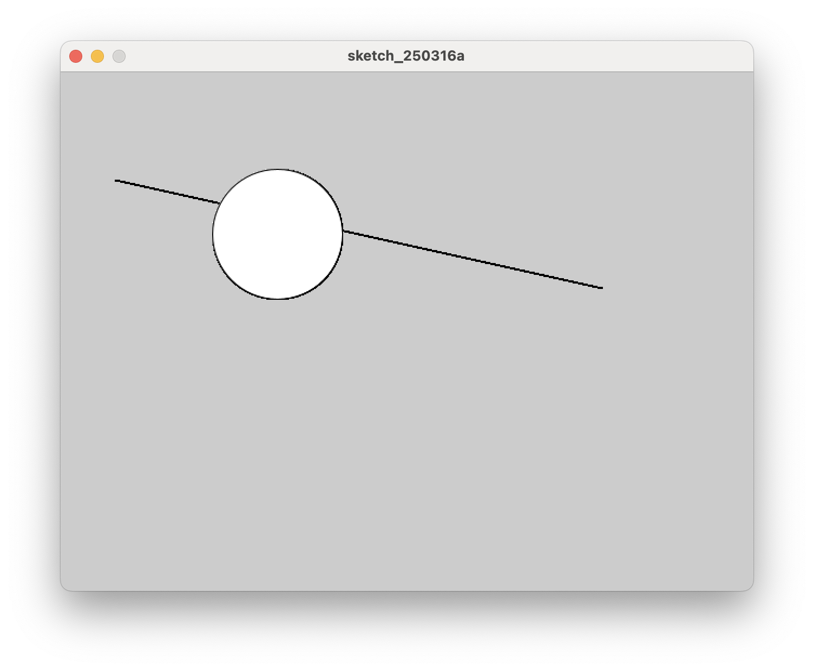

# 1. 프로세싱 코딩의 기본 형식



프로세싱 코딩의 기본 형식을 알아 본다.

```java title="proc-001.pde" linenums="1"
void setup() {
    size(640, 480);
}

void draw() {
    line(50, 100, 500, 200);
    circle(200, 150, 120);
}

```

- 코딩 하고 왼쪽 상단에 있는 PLAY 버튼을 누르면 동작한다.
- 멈출 때는 STOP 버튼 누르기!

## 셋업과 드로우 (Setup & Draw)
- 프로세싱은 setup 내용을 1번 실행하고, draw에 있는 내용을 순서대로 반복한다.
- 무한정, 계속, 그만하라 할때까지.

## setup()
- 그림 그리기의 기본 구성을 작성한다.
- size : 그림 그릴 도화지의 (가로, 세로) 크기다. 단위는 pixel
- 왼쪽 상단이 x, y의 원점 (0, 0)이다.

## draw()
- 여기 있는 내용이 순서대로 한줄 씩 실행된다.
- 끝까지 실행하면 다시 draw() 안에 있는 내용을 처음부터 실행한다.
- 끝이 안난다.
- 스톱 버튼을 누르면 끝난다.
- 이 프로그램에서는 변화가 보이지 않는다.
- 같은 자리에 같은 그림을 계속 그리기 때문이다.


### 선 그리기
- 선을 그리는 것은 두 점을 연결하는 것이다.
- line 명령에 두 점의 좌표를 알려주면 선이 그어진다.
- line(x1, y1, x2, y2) 형식
- 그림판의 왼쪽 상단이 x, y의 원점 (0, 0)이다.
- 이번 코드에서는 점1(50, 100)에서 점2(500, 200)까지 두 점을 잇는 선을 그린다.

### 원 그리기
- 원 그리기는 중심점의 위치와 지름을 알려주면 된다.
- circle(x, y, diameter) 형식
- 그림판의 왼쪽 상단이 x, y의 원점 (0, 0)이다.
- 이번 코드에서는 원점(200, 150)에 지름 120인 원을 그린다.