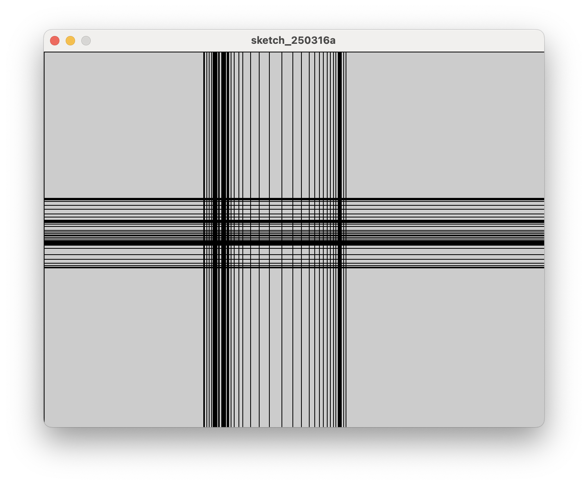
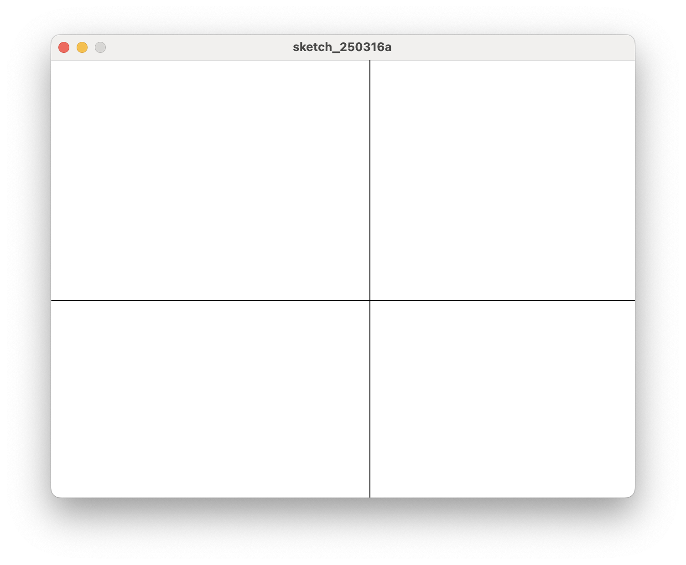

# 2. 마우스 위치를 나타내기

## 마우스 위치에 가로/세로 선 그리기




```java title="proc-002.pde" linenums="1"
void setup() {
    size(640, 480);
}

void draw() {
    line(0, mouseY, width, mouseY);
    line(mouseX, 0, mouseX, height);
}

```

- 프로세싱에는 시스템 정보를 알 수 있는 **환경변수**가 있다.
- 이번에는 width, height, mouseX, mouseY 이렇게 4가지를 사용한다.
- width와 height는 size()에 입력했던 가로, 세로 크기다.
- mouseX, mouseY는 현재 마우스가 도화지 위에 위치한 좌표다.

코드 설명
- 마우스가 있는 위치에 가로, 세로 선을 그렸다.
- 마우스가 이동하면 선이 계속 나타난다.
- 마우스 움직임을 그림으로 나타내는 것이다.
- 이미 있던 자리의 선이 그대로 있으면서 새로운 선이 그려지니 점점 화면이 꽉 차게 된다.
- draw() 안에 있는 내용을 반복할 때마다 배경을 지우면 깔끔한 선이 그려진다.
- 일부러 복잡한 그릴 수도 있고, 깔끔한 선분을 표현할 수도 있다.


## 깔끔한 그림으로 표시하기

```java title="proc-002.pde" linenums="1" hl_lines="6"
void setup() {
    size(640, 480);
}

void draw() {
    background(255);
    line(0, mouseY, width, mouseY);
    line(mouseX, 0, mouseX, height);
}

```

* Line 6에 있는 background(255); 문장이 배경을 흰색으로 칠한다는 것를 뜻한다.
* 참고로 255는 흰색, 0은 검정색, 0에서 255 사이 값은 흰색과 검은색 사이의 중간값이 된다.


