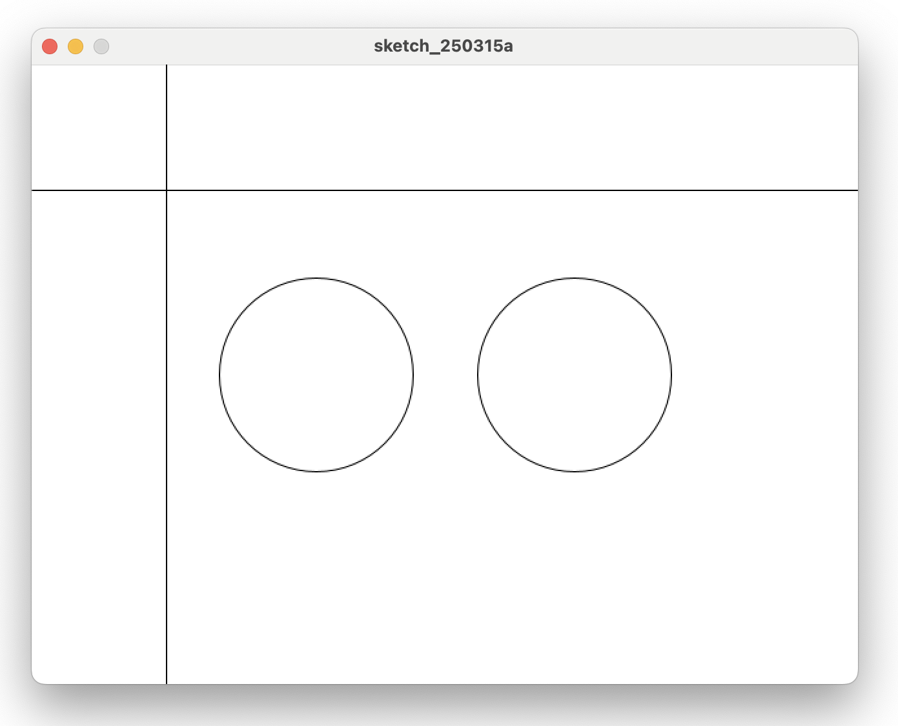

# 3. 변수 Variable

- 그림판의 중심에서 왼쪽과 오른쪽에 원을 2개 그린다. 각각 1개씩, 지름이 150인 원
- 마우스 위치 표시는 그대로 한다.




```java title="proc-003.pde" linenums="1" hl_lines="7-8"
void setup() {
    size(640, 480);
}
​
void draw() {
    background(255);
    circle(width/2 -100, height/2, 150);
    circle(width/2 +100, height/2, 150);
    line(0, mouseY, width, mouseY);
    line(mouseX, 0, mouseX, height);
}

```

- 7번 8번 줄에 circle 명령에서 `width/2` 가 쓰였다.
- 프로세싱의 그림판 가로크기를 2로 나눈 값이다. 여기서는 640의 반인 320이 된다.
- `setup()`의 `size()`에서 숫자를 바꾸면 `width/2`값도 자동으로 수정된다.
- `width`라는 변수를 사용하지 않는다면 숫자가 바뀔 때마다 여러곳에 있는 숫자를 함께 바꿔야 한다.
- 마우스의 좌표처럼 숫자가 계속 바뀔 수 있으므로 변수를 사용하면 여러 상황에 대처할 수 있다.
- `width/2 와 height/2` 처럼 변수는 그 값에 계산을 할 수 있다.
- 화면(그림판) 가로크기 절반, 세로크기 절반에 해당하는 위치가 화면의 중심이다.
- 중심에서 가로 방향으로 -100, +100 위치에 원을 그리면 화면의 중심에서 왼쪽과 오른쪽에 적당히 벌어진 그림이 그려진다.
- `size()` 안에 있는 숫자를 바꾸더라도 2개의 원은 항상 화면의 중심에서 지정된 거리만큼 떨어져 위치한다.
