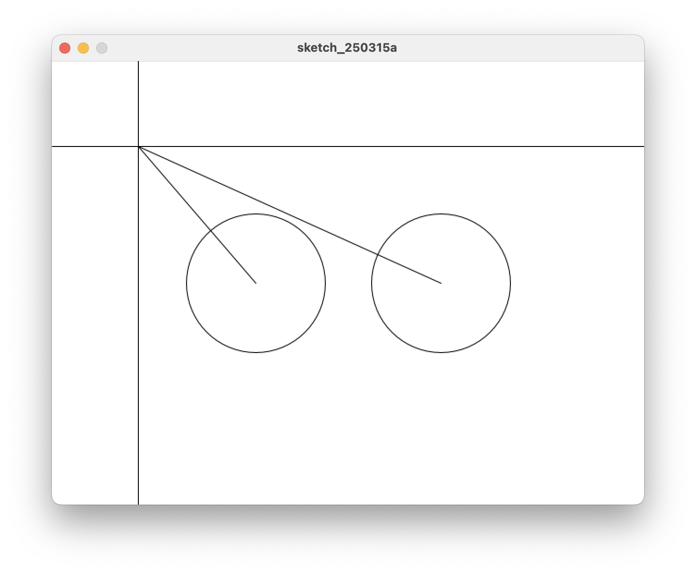

# 4. 변수 사용하기

원의 중심에서 마우스 위치까지 선을 그려보자.




```java title="proc-004.pde" linenums="1" hl_lines="10-22"
int x1, y1, x2, y2;

void setup() {
    size(640, 480);
}
​
void draw() {
    background(255);

    // 두 원의 중심점 좌표값 설정하기
    x1 = (width / 2) - 100;
    x2 = (width / 2) + 100;
    y1 = height / 2;
    y2 = height / 2;

    // 원 2개 그리기
    circle(x1, y1, 150);
    circle(x2, y2, 150);

    // 원의 중심에서 마우스 까지 선 그리기
    line(x1, y1, mouseX, mouseY);
    line(x2, y2, mouseX, mouseY);

    // 마우스 위치 표시
    line(0, mouseY, width, mouseY);
    line(mouseX, 0, mouseX, height);
}

```

- 선 그리기 `line()`을 사용한다.
- 원의 중심점을 표시하는 x1, y2, x2, y2 좌표를 변수로 만든다. (Line 1)
- 원의 중심점의 좌표를 저장하는 변수는 `숫자` 형식의 값을 가지기 때문에 변수의 종류를 `int` 타입이라고 선언한다. (line 1)
- `int : integer` int 는 `정수`를 의미하는 기호다.
- Line 1은 "이제부터 정수 형식의 data를 저장될 수 있는 변수 x1, y1, x2, y2 를 사용한다." 라는 의미다.