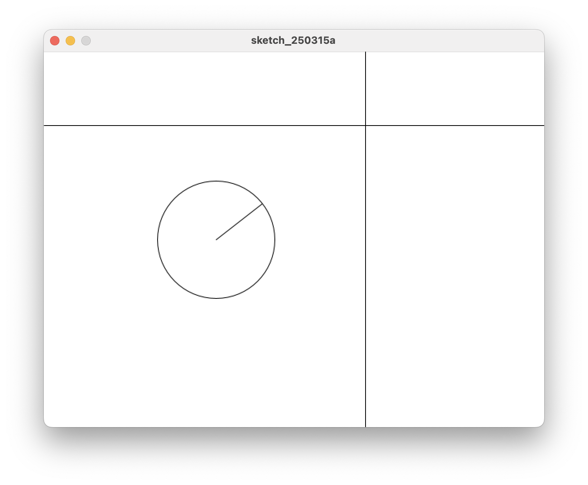

# 5. 좌표 계산하기

원의 중심에서 마우스 위치로 이어지는 선을 그리는데, 원 밖으로 삐져 나오지 않게 그리려고 한다.

이 부분은 약간의 계산이 필요한데, 코드를 단순하게 보기 위해 그림을 하나만 그려서 시도해 보자.

## 마우스 위치까지 선 그리기


```java title="proc-005.pde" linenums="1" hl_lines="1-2"
float x1, y1;
float dimeter = 150;

void setup() {
    size(640, 480);
}
​
void draw() {
    background(255);

    x1 = (width / 2) - 100;
    y1 = height / 2;
    
    circle(x1, y1, diameter);
    
    line(x1, y1, mouseX, mouseY);
    
    line(0, mouseY, width, mouseY);
    line(mouseX, 0, mouseX, height);
}

```

* 원 1개만 그리기
* 이번에는 Line 1에서 `int` 대신 `float`를 사용했다.
* `float`는 소숫점이 있는 숫자를 의미한다.
* 여기서는 나누기와 수학 계산이 필요해서 정수 보다는 소숫점이 있는 숫자 형식으로 바꿨다.
* 반지름 150도 수정하기 편하도록 변수 `diameter`를 만들어 쓴다. (Line 2, 14)


## 마우스 방향으로 선 그리기


```java title="proc-005-1.pde" linenums="1" hl_lines="14-23"
float x1, y1;
float diameter = 150;

void setup() {
    size(640, 480);
}
​
void draw() {
    background(255);

    x1 = (width / 2) - 100;
    y1 = height / 2;

    // 원의 중심에서 마우스 위치 방향 각도를 계산하고
    // 반지름 길이만큼 떨어진 자리의 좌표를 구한다.
    float ta, tx, ty;
    ta = atan2(mouseY - y1, mouseX - x1);
    tx = x1 + cos(ta) * diameter / 2;
    ty = y1 + sin(ta) * diameter / 2;
    
    // 원을 그리고, 마우스 방향의 새 좌표까지 선을 그린다.
    circle(x1, y1, diameter);
    line(x1, y1, tx, ty);
    
    line(0, mouseY, width, mouseY);
    line(mouseX, 0, mouseX, height);
}

```

* 원1개 그리기에서 수정한다.
* Line 14-23 사이의 내용이 마우스 방향으로 새 좌표를 구하는 방법이다.
* `ta`는 원의 중심(x1, y1)에서 마우스 위치까지의 각도를 구해서 저장하는 변수다.
* `tx`는 원의 중심에서 ta 각도로, 원의 반지름 만큼 떨어진 곳의 x 좌표를 저장한다.
* `ty`는 원의 중심에서 ta 각도로, 원의 반지름 만큼 떨어진 곳의 y 좌표를 저장한다.


## 마우스 방향으로 선 그리기


* `atan2()` 는 두 점 사이의 각도를 알려준다.
* 그림에서 `atan2(mouseY - y, mouseX - x)` 형식으로 사용한다.
* `atan2()`에는 Y 좌표를 먼저 계산하는 것이 특이사항이다.
* `atan2()`으로 구한 각도값에 `sin()`, `cos()` 계산을 추가하면 좌표를 구할 수 있다.
* `atan2()`으로 구한 각도에 `sin()` 함수를 사용하면 Y 좌표 값을 구한다.
* `현재위치 Y 좌표 + (sin()에 atan2()로 구한 각도값 넣어서 알게된 Y 값 * 거리)` 계산으로 현재위치에서 atan2()로 구한 각도로, 지정한 거리만큼의 Y 좌표를 구한다.
* `atan2()`으로 구한 각도에 `cos()` 함수를 사용하면 X 좌표 값을 구한다.
* Line 22-24 사이의 계산을 공식처럼 사용하자.