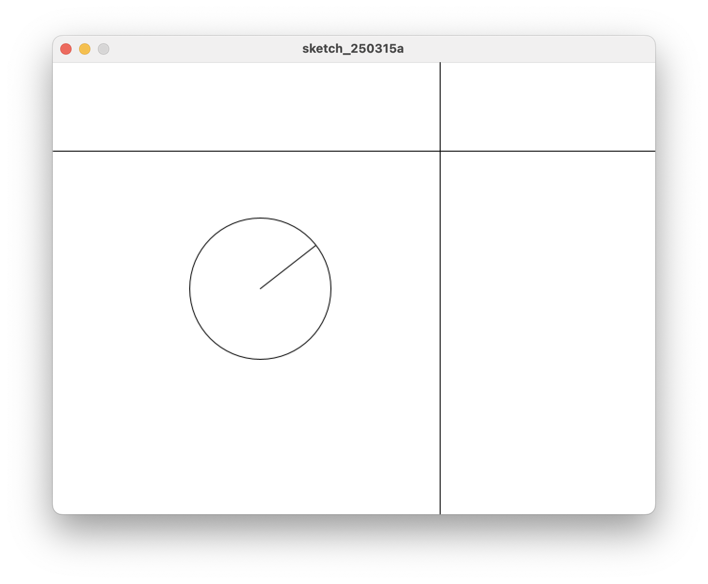

# 6. Class 사용하기

원의 중심에서 마우스 방향의 선을 그리는 원을 하나 만들었다.
이런 원이 여러 개가 필요하다면, 그때 마다 원의 중심 좌표 변수를 만들어야 해서 불편하다.
여기서의 경우처럼, 원 모양이 같고 화살표 방향이 다른 것을 표현하기 위해 `Class`를 사용한다.
(다른 위치에서 마우스를 바라보니 화살표 방향이 다르다)

`Class`는 같은 성질을 가지면서 다른 표현을 하기 위한 것이다.

앞에서 만든 원 1개를 `class`를 이용해 만들고 활용해 보자.


## 클라스 작성

```java title="proc-006.pde" linenums="1"
class CircleArrow {
    float x;     // 원의 x 좌표
    float y;     // 원의 y 좌표
    float r;     // 원의 반지름
    float tx;    // 마우스 방향 원 위의 점 x 좌표, target x
    float ty;    // 마우스 방향 원 위의 점 y 좌표, target y
    float ta;    // 원의 원점에서 마우스 방향 각도, target angle
  
    // 클라스 변수를 생성하고 초기화 한다.
    CircleArrow(float posX, float posY, float diameter) {
        x = posX;
        y = posY;
        r = diameter / 2;
        tx = 0;
        ty = 0;
        ta = 0;
    }
  
    // 목표 지점으로 방향을 찾고, 원과 만나는 좌표를 계산해 저장한다.
    void show(float targetX, float targetY) {
        ta = atan2(targetY - y, targetX - x);
        tx = x + cos(ta) * r;
        ty = y + sin(ta) * r;
        circle(x, y, r * 2);
        line(x, y, tx, ty);
    }
}

```

* 여러개의 원을 그릴 때, 각각의 원은 위치좌표(x, y)와 지름만 다르고 하는 일은 같다.
* 이럴때 Class를 이용해 하나의 원형을 만들고, 그 원형을 활용해 각각의 원을 생성한다.
* 이 코드는 하나의 원형을 만드는 것이다.
* 원형을 만드는 생성함수 `CircleArrow()`와 만들어진 원을 보여주는 `show()` 기능이 포함된 Class다.
* 이 클라스를 이용해 1개의 원을 그려보자.


## 클라스를 포함한 전체 코드

화살표가 있는 원 1개를 클라스로 표현하기

=== "메인 코드"
    ```java title="proc-006.pde" linenums="1"

    CircleArrow ca;      // 클라스를 사용해 ca 를 선언한다. 앞으로 ca를 쓰겠다.

    void setup() {
        size(640, 480);
        // 오브젝트 ca 를 만든다. 위치 정보와 지름을 알려준다.
        ca = new CircleArrow((width/2) -100, height/2, 150);
    }

    void draw() {
        background(255);
        
        // ca의 화살표가 마우스 위치를 향하도록 업데이트 하고, 보여준다.
        ca.show(mouseX, mouseY);
        
        line(0, mouseY, width, mouseY);
        line(mouseX, 0, mouseX, height);
    }

    ```

=== "Class 코드"

    ```java title="CircleArrow.pde" linenums="1"
    class CircleArrow {
        float x;     // 원의 x 좌표
        float y;     // 원의 y 좌표
        float r;     // 원의 반지름
        float tx;    // 마우스 방향 원 위의 점 x 좌표, target x
        float ty;    // 마우스 방향 원 위의 점 y 좌표, target y
        float ta;    // 원의 원점에서 마우스 방향 각도, target angle
    
        // 클라스 변수를 생성하고 초기화 한다.
        CircleArrow(float posX, float posY, float diameter) {
            x = posX;
            y = posY;
            r = diameter / 2;
            tx = 0;
            ty = 0;
            ta = 0;
        }
    
        // 목표 지점으로 방향을 찾고, 원과 만나는 좌표를 계산해 저장한다.
        void show(float targetX, float targetY) {
            ta = atan2(targetY - y, targetX - x);
            tx = x + cos(ta) * r;
            ty = y + sin(ta) * r;
            circle(x, y, r * 2);
            line(x, y, tx, ty);
        }
    }

    ```

클라스 코드가 별도로 빠지면서 메인코드는 간단하게 작성되었다.

* Line 1 에서 `ca`라고 부를 Class 하나를 지정했다.
* Line 1 은 ^^CircleArrow 라는 클라스 원형을 따르는 ca라는 것을 사용할 것이다(underline)^^ 라는 의미다.
* Line 6 에서 `ca`를 생성한다. 위치와 지름을 여기서 정한다.
* Line 13 에서 `ca`를 사용한다.


## 클라스 코드 저장 방법

* 클라스 코드는 메인코드에 함께 작성하기도 하고 따로 저장 해 재사용 할 수 있다.

* 클라스 코드는 따로 작성할 경우, 메인 코드가 있는 폴더에 함께 저장하여 사용한다.
* 클라스 파일을 따로 저장할 때, 클라스 코드의 파일명은 클라스의 이름과 같아야 한다. (CircleArrow.pde)

* 메인 코드와 클라스 코드를 같은 파일(proc-007.pde)에 작성할 경우 class 내용은 메인 파일 내 어디에 위치해도 상관 없다.
* 여기서는 뒤쪽에 위치 시키는 방법을 썼다.
* 나중에 수정할 때 Class를 수정하는 것 보다 메인코드 수정할 일이 더 많기 때문이다.

```java title="proc-006.pde"
    void setup() {
        // 내용
    }

    void draw() {
        // 내용
    }

    class CircleArrow {
        // 클라스 내용
    }
```

## 실행한 모습


* 마우스를 움직이면 원 안에 있는 선이 마우스가 있는 위치를 따라 다닌다.
