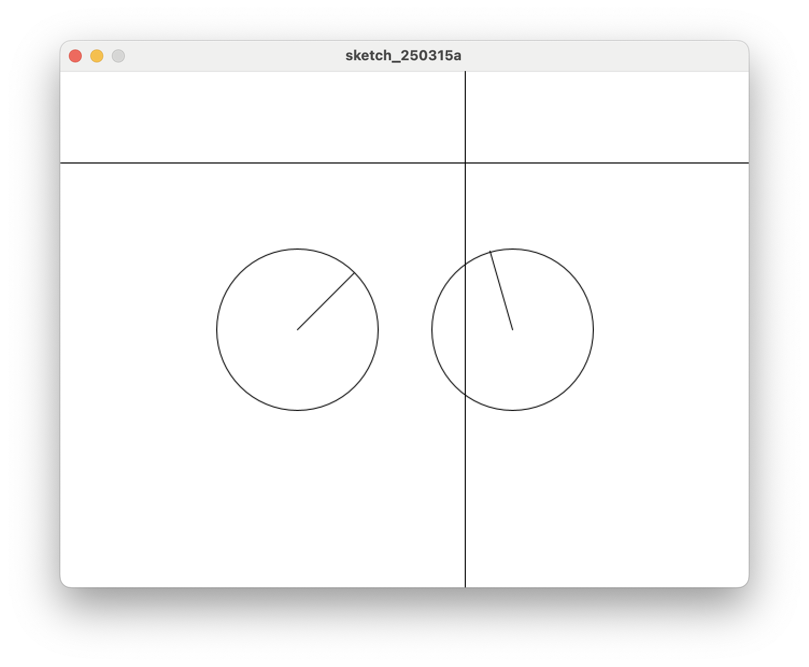

# 7. Class로 원 2개 그리기

클라스를 사용해 원을 2개 그려 보자.



=== "메인 코드"
    ```java title="proc-007.pde" linenums="1" hl_lines="6-7"

    CircleArrow ca1, ca2;      // 클라스를 사용해 ca 를 선언한다. 앞으로 ca를 쓰겠다.

    void setup() {
        size(640, 480);
        
        ca1 = new CircleArrow((width/2) -100, height/2, 150);
        ca2 = new CircleArrow((width/2) +100, height/2, 150);
    }

    void draw() {
        background(255);
        
        ca1.show(mouseX, mouseY);
        ca2.show(mouseX, mouseY);
        
        line(0, mouseY, width, mouseY);
        line(mouseX, 0, mouseX, height);
    }

    ```

=== "Class 코드"

    ```java title="CircleArrow.pde" linenums="1"
    //
    // 만들어 둔 Class를 그대로 쓴다
    //
    class CircleArrow {
        float x;     // 원의 x 좌표
        float y;     // 원의 y 좌표
        float r;     // 원의 반지름
        float tx;    // 마우스 방향 원 위의 점 x 좌표, target x
        float ty;    // 마우스 방향 원 위의 점 y 좌표, target y
        float ta;    // 원의 원점에서 마우스 방향 각도, target angle
    
        // 클라스 변수를 생성하고 초기화 한다.
        CircleArrow(float posX, float posY, float diameter) {
            x = posX;
            y = posY;
            r = diameter / 2;
            tx = 0;
            ty = 0;
            ta = 0;
        }
    
        // 목표 지점으로 방향을 찾고, 원과 만나는 좌표를 계산해 저장한다.
        void show(float targetX, float targetY) {
            ta = atan2(targetY - y, targetX - x);
            tx = x + cos(ta) * r;
            ty = y + sin(ta) * r;
            circle(x, y, r * 2);
            line(x, y, tx, ty);
        }
    }

    ```

* 메인코드 Line 6-7 에서 `ca1, ca2`를 설정한다.
* 메인코드 Line 13-14 에서 `ca1, ca2`를 사용한다.