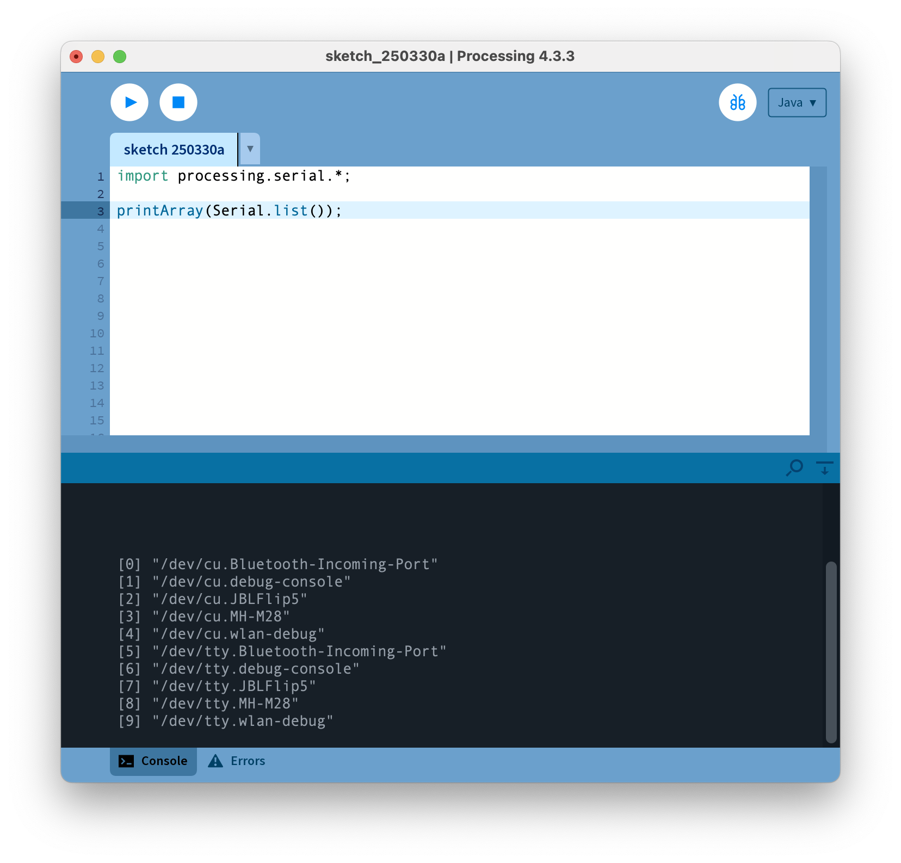

# 8. Serial 통신

시리얼 포트를 사용해 외부와 통신하기

## Serial Write

```java title="proc-008.pde" linenums="1" hl_lines="7"
import processing.serial.*;

Serial port;

void setup() {
    size(255, 255);
    port = new Serial(this, "COM3", 115200);
}

void draw() {
    background(255);
  
    port.write(mouseX + ", " + mouseY + '\n');

    line(0, mouseY, width, mouseY);
    line(mouseX, 0, mouseX, height);
}
```

* Line 7 에서 "COM3" 의 내용은 컴퓨터 시리얼 포트의 이름으로 바꾼다.
* 참고로 시리얼포트 이름은 컴퓨터마다 달라서 확인해 보아야 한다.
* 시리얼포트로 출력되는 내용은 `128, 332` 처럼 숫자와 쉼표로 이뤄져 있다.
* Line 13 에서 `write()` 안에 지정된 형식과 내용이다.
* 끝에 있는 \n 기호는 전송된 문장의 끝을 알리는 것이다.


## Serial Port 이름 찾기
```java title="proc-011-1.pde" linenums="1"
import processing.serial.*;
printArray(Serial.list());

```

* 이렇게만 입력하고 실행하면 시리얼포트 이름들이 나온다.



* 목록에 나타난 `[3] "/dev/cu.MH-M28"` 의 경우, `/dev/cu.MH-M28`이 시리얼포트 이름이다.


## Serial Read

```java title="proc-008-read.pde" linenums="1" hl_lines="18-24"
import processing.serial.*;

Serial port;
int sData = 0;

void setup() {
    size(255, 255);
    port = new Serial(this, "COM3", 115200);
}

void draw() {
    background(255);
    fill(255, 255, 0);
    textSize(30);
    text("Var: " + nf(sData, 4), 20, 30);
    // nf() 숫자를 지정한 숫자 자릿수만큼 채워서 출력한다
    float x = map(sData, 0, 1023, 0, width);
    ellipse(x, height/2, 80, 80);
}

void serialEvent(Serial port) {
    String str = port.readStringUntil("\n");
    if(str != null) {
        String s = trim(str);
        sData = int(s);
    }
}
```
