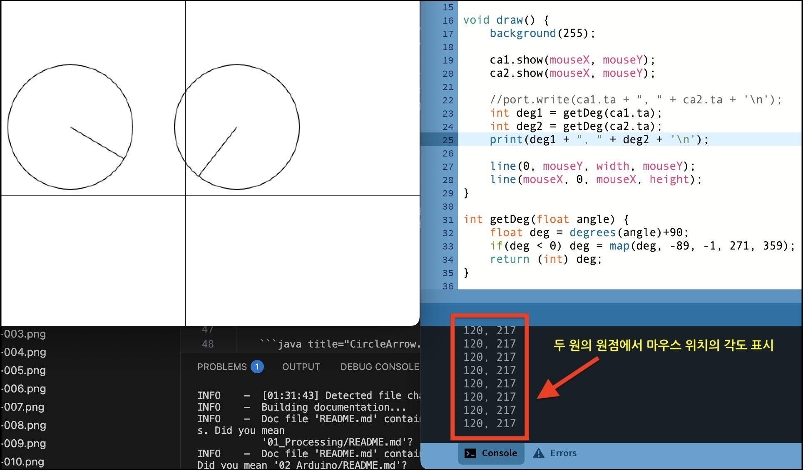

# 9. CircleArrow + SerialWrite

마우스 방향을 가르키는 원 2개를 그리고, 화살표의 방향을 시리얼포트로 출력하기

## 원과 마우스의 각도를 출력하기

* 앞서 작성한 코드를 참조해 각도를 출력할 수 있게 한다.
* 클라스는 그대로 쓰고, 메인 코드만 수정한다.

* 참고링크 : [클라스로 원 2개 만들기](/01_Processing/07_Class_2ea)

=== "메인 코드"
    ```java title="proc-009.pde" linenums="1" hl_lines="16-18"

    CircleArrow ca1, ca2;

    void setup() {
        size(640, 480);
        
        ca1 = new CircleArrow((width/2) -100, height/2, 150);
        ca2 = new CircleArrow((width/2) +100, height/2, 150);
    }

    void draw() {
        background(255);
        
        ca1.show(mouseX, mouseY);
        ca2.show(mouseX, mouseY);
        
        int deg1 = getDeg(ca1.ta);
        int deg2 = getDeg(ca2.ta);
        print(deg1 + ", " + deg2 + '\n');

        line(0, mouseY, width, mouseY);
        line(mouseX, 0, mouseX, height);
    }

    int getDeg(float angle) {
        float deg = degrees(angle)+90;
        if(deg < 0) deg = map(deg, -89, -1, 271, 359);
        return (int) deg;
    }

    ```

=== "Class 코드"

    ```java title="CircleArrow.pde" linenums="1"
    //
    // 만들어 둔 Class를 그대로 쓴다
    //
    class CircleArrow {
        float x;     // 원의 x 좌표
        float y;     // 원의 y 좌표
        float r;     // 원의 반지름
        float tx;    // 마우스 방향 원 위의 점 x 좌표, target x
        float ty;    // 마우스 방향 원 위의 점 y 좌표, target y
        float ta;    // 원의 원점에서 마우스 방향 각도, target angle
    
        // 클라스 변수를 생성하고 초기화 한다.
        CircleArrow(float posX, float posY, float diameter) {
            x = posX;
            y = posY;
            r = diameter / 2;
            tx = 0;
            ty = 0;
            ta = 0;
        }
    
        // 목표 지점으로 방향을 찾고, 원과 만나는 좌표를 계산해 저장한다.
        void show(float targetX, float targetY) {
            ta = atan2(targetY - y, targetX - x);
            tx = x + cos(ta) * r;
            ty = y + sin(ta) * r;
            circle(x, y, r * 2);
            line(x, y, tx, ty);
        }
    }

    ```

* Line 16-18, 24-28 내용이 새롭게 추가된 것이다.
* 각 원의 중심에서 마우스 포인트롤 향하는 각도를 계산해 출력하고 있다.




## 시리얼포트로 출력하기
```java title="proc-009.pde" linenums="1" hl_lines="24"
import processing.serial.*;

Serial port;

CircleArrow ca1, ca2;

void setup() {
    size(640, 480);
    
    port = new Serial(this, "COM3", 115200);
    
    ca1 = new CircleArrow((width/2) -100, height/2, 150);
    ca2 = new CircleArrow((width/2) +100, height/2, 150);
}

void draw() {
    background(255);
    
    ca1.show(mouseX, mouseY);
    ca2.show(mouseX, mouseY);
    
    int deg1 = getDeg(ca1.ta);
    int deg2 = getDeg(ca2.ta);
    port.write(dog1 + ", " + deg2 + '\n');

    line(0, mouseY, width, mouseY);
    line(mouseX, 0, mouseX, height);
}

int getDeg(float angle) {
    float deg = degrees(angle)+90;
    if(deg < 0) deg = map(deg, -89, -1, 271, 359);
    return (int) deg;
}

```

* 시리얼포트 관련 Line 1, 3, 10 내용이 새롭게 추가된 것이다.
* Line 24 화면출력(print) 대신 시리얼포트로 내용을 출력한다.
* 두 각도 값을 시리얼 포트로 내보낸다.
* 시리얼 값이 어떻에 사용될 지는 프로세싱에서 알 수 없다. 그저 보내기만 할 뿐!