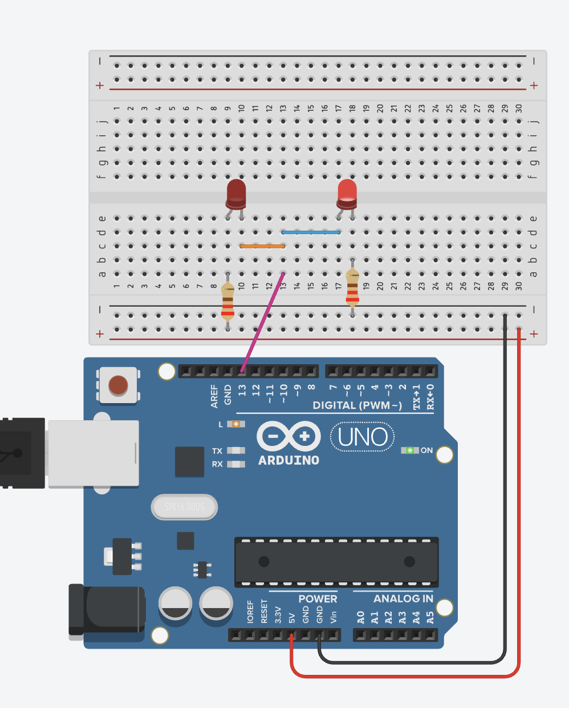
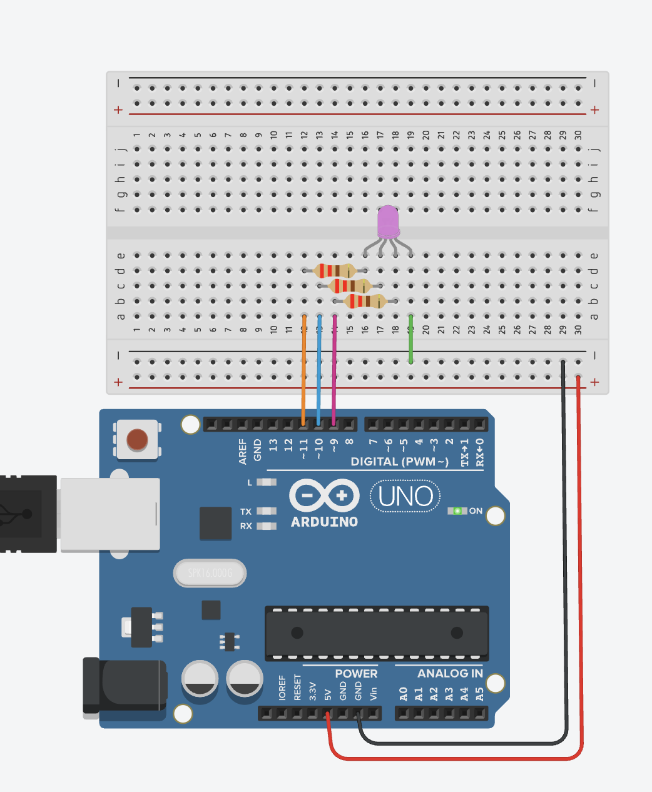

# 2. 아두이노에서 LED 켜보기

## 회로 구성



## 코드 1. LED 깜빡이기

```cpp title="led-blink.ino" linenums="1" hl_lines="1"
const int led = 13;

void setup() {
  pinMode(led, OUTPUT);
}

void loop() {
  digitalWrite(led, HIGH);
  delay(500);

  digitalWrite(led, LOW);
  delay(500);
}
```

* digitalWrite()에서 HIGH 일때 켜지는 것과 LOW 일때 켜지는 것의 회로를 비교해 보자.
* 어느쪽이 HIGH 인지 LOW 인지 구분하기 어렵다면, 둘 중 한쪽 delay()에 시간을 길게 만들고 시도해 보자.


## 코드 2. LED 밝기 조절

```cpp title="led-analog.ino" linenums="1" hl_lines="8"
const int led = 13;

void setup() {
  pinMode(led, OUTPUT);
}

void loop() {
  analogWrite(led, 550);
  delay(500);

  analogWrite(led, 250);
  delay(500);
}
```

* Line 8 에서, `digitalWrite()` 대신 `analogWrite()`를 사용했따.
* `analogWrite()`는 0~255 사이 값을 지정하여 밝기를 조절할 수 있다.
* 회로 구성에 따라 0 에서 가장 밝은 것, 255에서 가장 밝은 것으로 차이를 보인다.


## 코드 3. LED 3구성, 컬러 조절



```cpp title="led3color.ino" linenums="1" hl_lines="1"
const int red   = 9;
const int green = 10;
const int blue  = 11;

void setup() {
  pinMode(red, OUTPUT);
  pinMode(green, OUTPUT);
  pinMode(blue, OUTPUT);
}

void loop() {
  analogWrite(red, 250);
  analoglWrite(green, 150);
  analogWrite(blue, 100);
  delay(500);

  analogWrite(red, 100);
  analogWrite(green, 250);
  analogWrite(blue, 150);
  delay(500);
}
```
