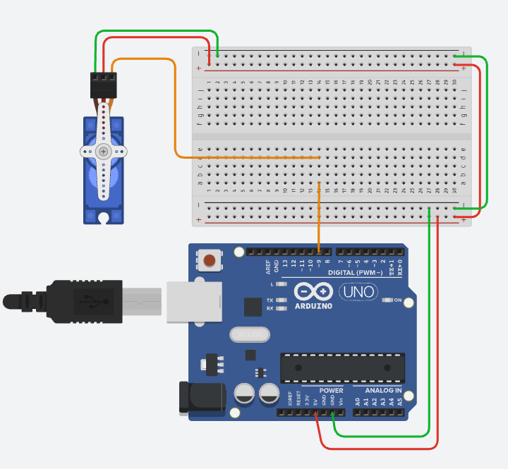
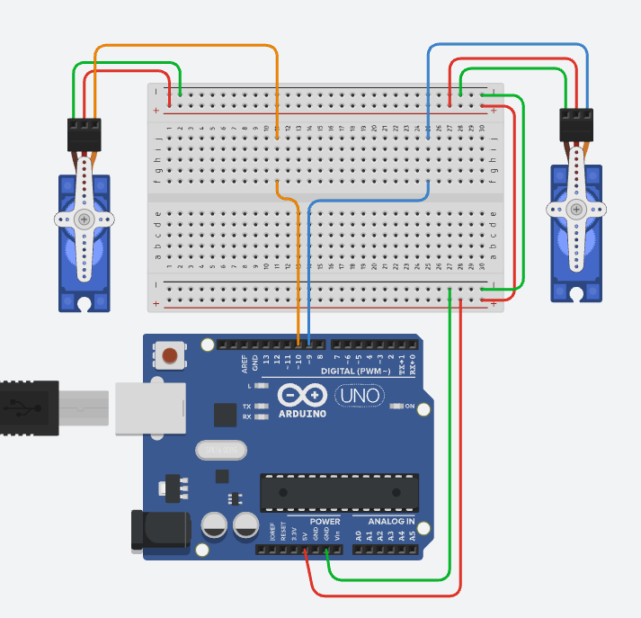

# 4. Servo 모터 사용하기

## 코드 1. 서보 모터 연결하기



```cpp title="servo.ino" linenums="1" hl_lines="1"
#include <Servo.h>

const int servoPin = 9;

Servo sv;

void setup() {
  sv.attach(servoPin);
}

void loop() {
  sv.write(0);
  delay(1000);

  sv.write(90);
  delay(1000);
  
  sv.write(180);
  delay(1000);
  
  sv.write(90);
  delay(1000);
}

```

* 서보모터를 연결하여 90도씩, 총 180도 범위의 움직임을 보여준다.


## 코드 2. 서보모터 2개 서서히 움직이기



```cpp title="servo-for-loop.ino" linenums="1" hl_lines="9"
#include <Servo.h>

const int servoPin1 = 9;
const int servoPin2 = 10;

Servo sv1, sv2;

void setup() {
  sv1.attach(servoPin1, 544, 2400);
  sv2.attach(servoPin2);
}

void loop() {
  for(int i=0; i <= 180; i++) {
    sv1.write(i);
    delay(1);
    sv2.write(180-i);
    delay(10);  
  }
  for(int i=0; i <= 180; i++) {
    sv1.write(180-i);
    delay(1);
    sv2.write(i);
    delay(10);  
  }
}
```
* Line 9에서, 서보 모터의 좌우 끝 범위를 수정할 수 있다. (기본값 544~2400)