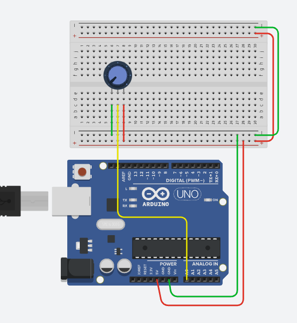

# 6. 입력센서 Volume 사용하기

## 코드 1. 볼륨값 읽기



```cpp title="volumeSerial.ino" linenums="1" hl_lines="9"
const int vol_pin = A0;

void setup() {
  Serial.begin(115200);
  Serial.println("===== Program Start =====");
}

void loop() {
  int value = analogRead(vol_pin);
  Serial.println(value);
  delay(10);
}
```


## 코드 2. 볼륨값을 시리얼 그래프로 보기

```cpp title="volumeGraph.ino" linenums="1" hl_lines="11-14"
const int vol_pin = A0;

void setup() {
  Serial.begin(115200);
  Serial.println("===== Program Start =====");
}

void loop() {
  int value = analogRead(vol_pin);
  
  Serial.print("0, 1023, ");
  Serial.print(value);
  Serial.print(", ");
  Serial.println(led_value);
  
  delay(10);
}
```


## 코드 3. 볼륨값을 시리얼 모니터로 보면서 LED 밝기 조절

```cpp title="volumeLed.ino" linenums="1" hl_lines="12"
const int vol_pin = A0;
const int led_pin = 13;

void setup() {
  pinMode(led_pin, OUTPUT);
  Serial.begin(115200);
  Serial.println("===== Program Start =====");
}

void loop() {
  int value = analogRead(vol_pin);
  int led_value = value / 4;
  
  analogWrite(led_pin, led_value);
  
  Serial.print("0, 1023, ");
  Serial.print(value);
  Serial.print(", ");
  Serial.println(led_value);
  
  delay(10);
}
```


## 코드 4. 볼륨값을 시리얼 모니터로 보면서 서보모터 제어

```cpp title="volumeServo.ino" linenums="1" hl_lines="17"
#include <Servo.h>

const int vol_pin = A0;
const int servo_pin = 9;

Servo sv;

void setup() {
  sv.attach(servo_pin, 544, 2400);

  Serial.begin(115200);
  Serial.println("===== Program Start =====");
}

void loop() {
  int value = analogRead(vol_pin);
  int sv_value = map(value, 0, 1023, 0, 180);
  
  sv.write(sv_value);
  
  Serial.print("0, 1023, ");
  Serial.print(value);
  Serial.print(", ");
  Serial.println(sv_value);
  
  delay(10);
}
```
