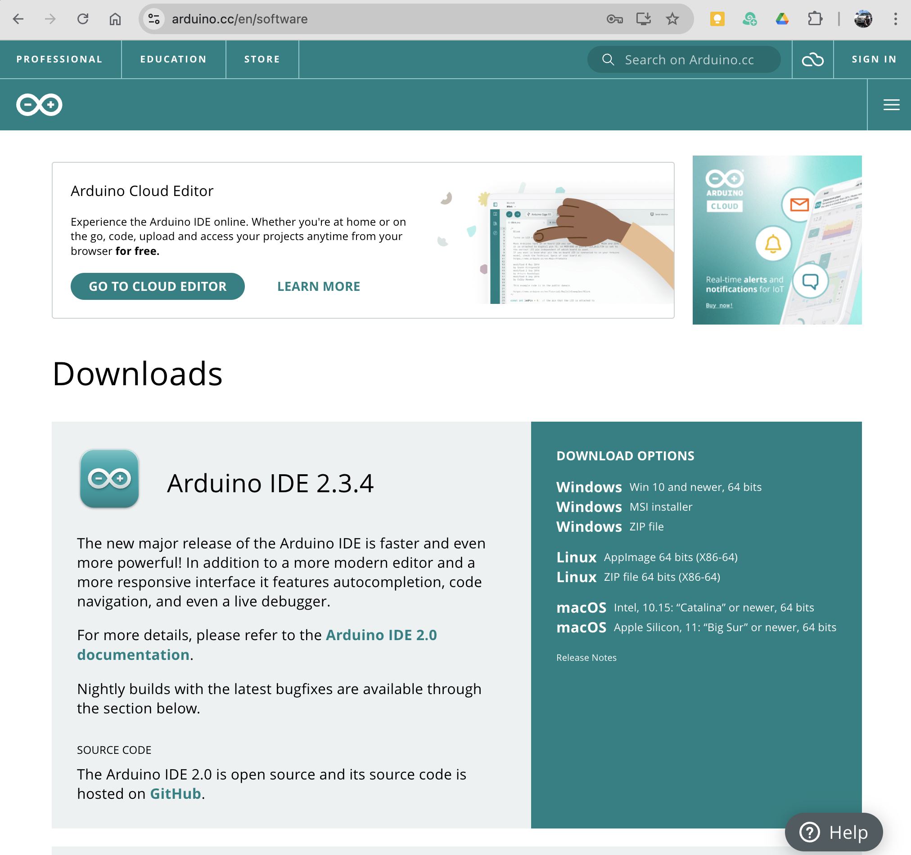

# Arduino Start

Arduino는 장치를 다루는데 사용한다. LED를 켜거나 모터를 움직이고, 센서를 사용해 외부의 값을 입력 받는 등, 실제적인 움직임을 감지하거나 표현하기 위해 사용한다.

- 사용자와 상호작용을 통해 그림을 변경할 수 있다.
- 하드웨어 장치와 연동하여 장치의 상태를 표시할 수 있다.
- 이런 특성을 사용해 고정된 그림이 아니라 여러가지 변화를 실시간으로 그림에 반영할 수 있다.
- 장치의 상태를 표현하거나 장치의 움직임을 모델링해서 보여주는 형식으로 사용될 수 있다.
- 여기서는 장치와 연동해서 그림의 변화를 장치에 전달하는 것을 목표로 한다.

## 다운로드
[아두이노 다운로드 페이지로 이동](https://arduino.cc/en/software){ .md-button }

