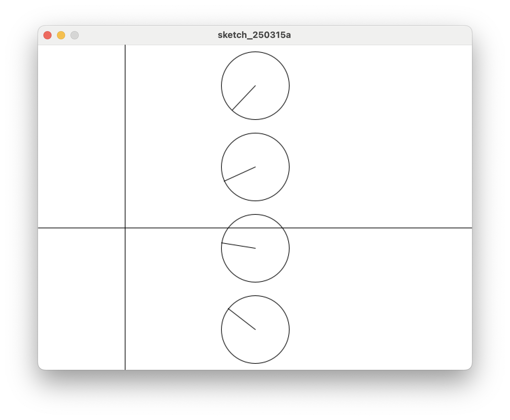

# 11. Class Array 2 (세로)

클라스를 사용해 원을 세로로 4개 만든다.



=== "메인 코드"

    ```java title="proc-011.pde" linenums="1" hl_lines="10-22"
    int yCnt = 4;       // 세로 방향 갯수
    int diam = 100;     // 원의 지름

    // CircleArrow 클라스의 객체를 여러개 보관할 변수 배열
    CircleArrow[] ca = new CircleArrow[yCnt];   
    ​
    void setup() {
        size(640, 480);
        
        // 세로축 크기를 원의 갯수로 나눔
        float yDist = height / yCnt;
        // 세로 첫번째 원과 마지막 원 사이 거리
        float yLen = yDist * (yCnt -1);
        // 첫번째 원의 세로 위치   
        float yStart = (height / 2) - (yLen / 2);
        
        // 객체를 생성한다.
        for(int j=0; j < yCnt; j++) {
            // 가로축의 중간에, 세로축 시작점(yStart)으로 부터 yDist 간격으로 배치하여
            // diam 크기의 원을 설정한다.
            ca[j] = new CircleArrow(width/2, yStart + (j * yDist), diam);
        }
    }
    ​
    void draw() {
        background(255);
    ​
        for(int j=0; j < yCnt; j++) {
            ca[j].show(mouseX, mouseY);
        }
    ​
        line(0, mouseY, width, mouseY);
        line(mouseX, 0, mouseX, height);
    }

    ```

=== "Class 코드"

    ```java title="CircleArrow.pde" linenums="1"
    class CircleArrow {
        float x;     // 원의 x 좌표
        float y;     // 원의 y 좌표
        float r;     // 원의 반지름
        float tx;    // 마우스 방향 원 위의 점 x 좌표, target x
        float ty;    // 마우스 방향 원 위의 점 y 좌표, target y
        float ta;    // 원의 원점에서 마우스 방향 각도, target angle
    
        CircleArrow(float posX, float posY, float diameter) {
            x = posX;
            y = posY;
            r = diameter / 2;
            tx = 0;
            ty = 0;
            ta = 0;
        }
    
        void show(float targetX, float targetY) {
            ta = atan2(targetY - y, targetX - x);
            tx = x + cos(ta) * r;
            ty = y + sin(ta) * r;
            circle(x, y, r * 2);
            line(x, y, tx, ty);
        }
    }

    ```

* 메인코드 Line 9 에서 객체를 배열로 저장하기 위해 객체 배열을 지정한다.
* 메인코드 Line 14-26 에서 객체 배열을 초기화 한다.
* `draw()` 부분은 매우 심플하다.