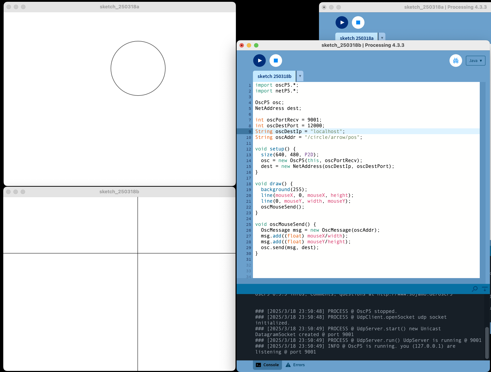

# 31. OSC Send

프로세싱에서 OSC 데이터 쓰기



```java title="proc-031.pde" linenums="1"

import oscP5.*;
import netP5.*;

OscP5 osc;
NetAddress dest;

int portNo = 9001;
int portDest = 12000;
String ipDest = "localhost";
String oscAddr = "/ca/pos";

void setup() {
    size(640, 480);
    osc = new OscP5(this, portNo);
    dest = new NetAddress(ipDest, portDest);
}

void draw() {
    background(255);
    line(mouseX, 0, mouseX, height);
    line(0, mouseY, width, mouseY);
    oscMouseSend();
}

void oscMouseSend() {
    OscMessage msg = new OscMessage(oscAddr);
    msg.add((float) mouseX / width);
    msg.add((float) mouseY / height);
    osc.send(msg, dest);
}
```