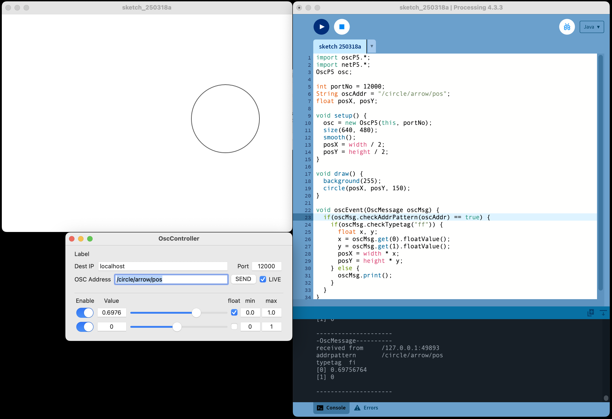

# 32. OSC Receive

프로세싱에서 OSC 데이터 읽기



```java title="proc-032.pde" linenums="1"

import oscP5.*;
import netP5.*;

OscP5 osc;

int portNo = 12000;
String oscAddr = "/ca/pos";
float posX, posY;

void setup() {
    size(640, 480);
    posX = width / 2;
    posY = height  / 2;
    osc = new OscP5(this, portNo);
}

void draw() {
    background(255);
    circle(posX, posY, 150);
}

void oscEvent(OscMessage oscMsg) {
    if(oscMsg.checkAddrPattern(oscAddr) == true) {
        if(oscMsg.checkTypetag("ff")) {
            float x, y;
            x = oscMsg.get(0).floatValue();
            y = oscMsg.get(1).floatValue();
            posX = width * x;
            posY = height * y;
        } else {
            oscMsg.print();
        }
    }
}
```