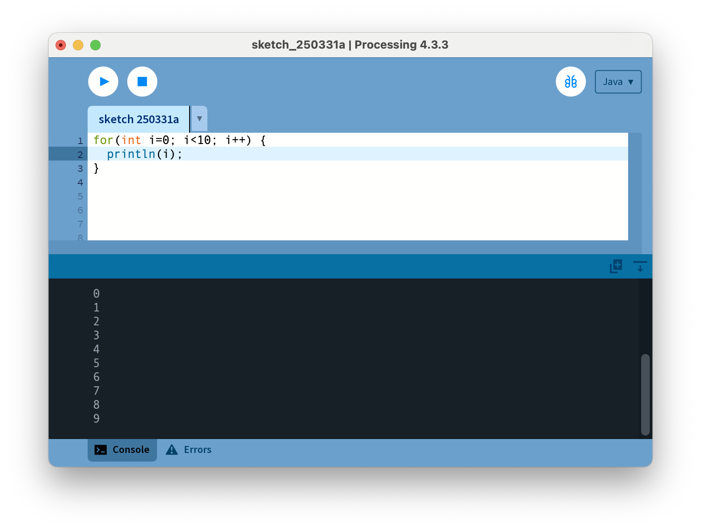

# 10-1. FOR-LOOP

반복되는 것을 간단하게 표현하기 위해 `FOR-LOOP`를 사용한다.

* FOR-Loop는 반복하는 횟수가 정해져 있거나, 반복하는 조건이 분명할 때 사용한다.
* 반복하는 동안 순차적인 변화가 있는 조건일 때 사용하기 좋다.
* 예) 10번 반복하기, 원을 5개 그리기

!!! note "FOR-LOOP"
    ```
    for ( 시작 조건 ;  반복 조건 ;  반복할 때 실행할 명령어) {
        // 반복할 내용
    }

    for (int i = 0;  i < 10;  i++) {
        // 시작 조건 : int i = 0;     // 정수형 변수 i 를 사용한다. 초기값은 0
        // 반복 조건 : i < 10;        // 변수 i 값이 10보다 작으면 반복, 같거나 크면 FOR-LOOP 벗어남
        // 반복시 실행할 명령 : i++;    // 변수 i 값을 반복할 때 마다 1 증가함
    }
    ```

```java title="proc-010-1.pde" linenums="1" hl_lines="1"
for(int i = 0; i < 10; i++) {
    println(i);
}
```



* 정수형 변수 i 가 0 으로 시작해서 10 보다 작은 동안 반복한다.
* 반복할 때 마다 i 를 1 씩 증가 시킨다.
* 반복할 때 마다 i 값을 print 한다.
