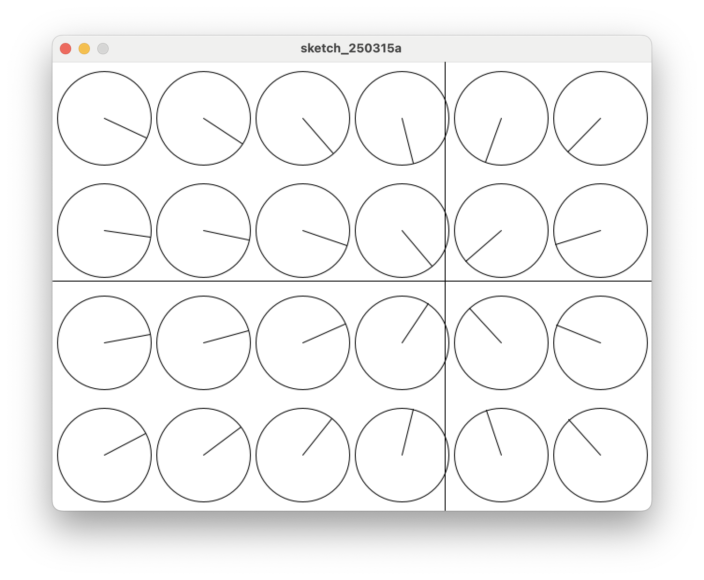

# 12. Class Array 3 (가로x세로)

클라스를 사용해 원을 가로 6개, 세로 4개 만든다.



=== "메인 코드"

    ```java title="proc-012.pde" linenums="1" hl_lines="16-29"
    //
    // 배열을 사용해 객체를 여러개 만든다
    //
    
    int xCnt = 6;       // 가로 방향 갯수
    int yCnt = 4;       // 세로 방향 갯수
    int tCnt = xCnt * yCnt;
    int diam = 100;     // 원의 지름

    // CircleArrow 클라스의 객체를 여러개 보관할 변수 배열
    CircleArrow[] ca = new CircleArrow[tCnt];
    ​
    void setup() {
        size(640, 480);
        
        float xDist = width / xCnt;
        float xLen = xDist * (xCnt -1);
        float xStart = (width / 2) - (xLen / 2);

        float yDist = height / yCnt;
        float yLen = yDist * (yCnt -1);
        float yStart = (height / 2) - (yLen / 2);
        
        for(int i=0; i < xCnt; i++) {
            for(int j=0; j < yCnt; j++) {
                int idx = (xCnt * j) + i;
                ca[idx] = new CircleArrow(xStart + (i * xDist), yStart + (j * yDist), diam);
            }
        }
    }
    ​
    void draw() {
        background(255);
    ​
        for(int i=0; i < tCnt; i++) {
            ca[i].show(mouseX, mouseY);
        }
    ​
        line(0, mouseY, width, mouseY);
        line(mouseX, 0, mouseX, height);
    }

    ```

=== "Class 코드"

    ```java title="CircleArrow.pde" linenums="1"
    //
    // 만들어 둔 Class를 그대로 쓴다
    //
    class CircleArrow {
        float x;     // 원의 x 좌표
        float y;     // 원의 y 좌표
        float r;     // 원의 반지름
        float tx;    // 마우스 방향 원 위의 점 x 좌표, target x
        float ty;    // 마우스 방향 원 위의 점 y 좌표, target y
        float ta;    // 원의 원점에서 마우스 방향 각도, target angle
    
        // 클라스 변수를 생성하고 초기화 한다.
        CircleArrow(float posX, float posY, float diameter) {
            x = posX;
            y = posY;
            r = diameter / 2;
            tx = 0;
            ty = 0;
            ta = 0;
        }
    
        // 목표 지점으로 방향을 찾고, 원과 만나는 좌표를 계산해 저장한다.
        void show(float targetX, float targetY) {
            ta = atan2(targetY - y, targetX - x);
            tx = x + cos(ta) * r;
            ty = y + sin(ta) * r;
            circle(x, y, r * 2);
            line(x, y, tx, ty);
        }
    }

    ```

* 메인코드 Line 16-29 에서 원의 위치를 배정한다.
* FOR-LOOP를 2중으로 구성했다.
* `draw()` 부분은 크게 바뀌지 않았다.