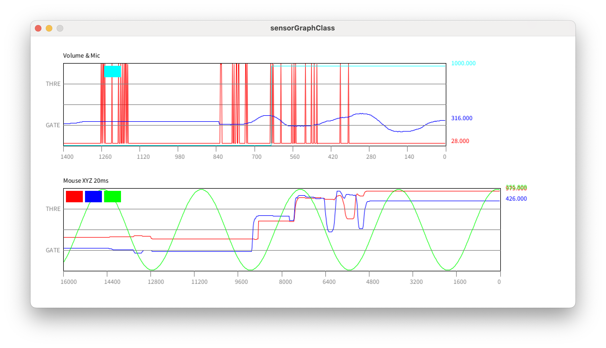

# 60. Data View Class

* Data View Class 사용하기



```java title="sensor_graph_mouse.pde" linenums="1"
SensorGraphMatrix sgm;

void setup() {
    size(1000, 300);
    // sgm Class 사용 ("이름", x축 위치, y축 위치, 가로 크기, 세로크기, 데이터 갯수)
    sgm = new SensorGraphMatrix("Mouse XYZ 20ms", 60, 80, 852, 152, 2);
    // 데이터 수집 간격 ms
    sgm.setInterval(20);
    // 데이터 순서, 최대값, 그래프 색깔
    sgm.setDataMaxNColor(0, width, color(255, 0, 0));
    sgm.setDataMaxNColor(1, height, color(0, 0, 255));
}

void draw() {
    background(255);

    if(sgm.isUpdate()) {
        sgm.add(0, mouseX);
        sgm.add(1, mouseY);
    }
    sgm.draw();
}

void mousePressed() {
    if(sgm.isClick()) sgm.toggle();
}
```

```java title="sensor_graph_sine.pde" linenums="1"
SensorGraphMatrix sgm;

int cntDegree = 0;

void setup() {
    size(1000, 300);
    sgm = new SensorGraphMatrix("Mouse XY & Sine", 60, 80, 852, 152, 3);
    sgm.setInterval(20);
    sgm.setDataMaxNColor(0, width, color(255, 0, 0));
    sgm.setDataMaxNColor(1, height, color(0, 0, 255));
    sgm.setDataMaxNColor(2, 360, color(0, 255, 0));
}

void draw() {
    background(255);

    if(sgm.isUpdate()) {
        sgm.add(0, mouseX);
        sgm.add(1, mouseY);
        sgm.add(2, 180 + sin(radians(cntDegree)) * 178);
        cntDegree++;
        if(cntDegree > 360) cntDegree = 0;
    }
    sgm.draw();
}

void mousePressed() {
    if(sgm.isClick()) sgm.toggle();
}
```

```java title="serialGraphMatrix.pde" linenums="1"
class SensorGraphMatrix {
    String name_tag;
    
    int posX;
    int posY;
    int boxW;
    int boxH;
    
    int cnt_data_set;
    int cnt_data;
    int g_height;
    
    float data[][];
    float dataMax[];
    color graphColor[];
    
    Boolean chk_update = true;
    long t_now;
    long t_pre[];
    int  t_int;
    
    float lv_trigger;
    float lv_squalch;
    Boolean trigger[];
    
    SensorGraphMatrix(int x, int y, int w, int h) {
        name_tag = "Sensor Graph";  // Default Graph Name
        cnt_data_set = 10;          // Default Data Count : 10
        t_int = 10;                 // Default Data Refresh : 10ms
        lv_trigger = 0.75;          // Default Trigger Point
        lv_squalch = 0.25;          // Default Squalch Point
        
        posX = x;
        posY = y;
        boxW = w;
        boxH = h;
        
        cnt_data = w -2;
        g_height = h -2;
        
        data = new float[cnt_data_set][cnt_data];
        dataMax = new float[cnt_data_set];
        graphColor = new color[cnt_data_set];
        trigger = new Boolean[cnt_data_set];
        
        t_now = 0;
        t_pre = new long[cnt_data_set];
        for(int i=0; i < cnt_data_set; i++) {
            t_pre[i] = 0;
            trigger[i] = false;
        }
    }
    
    SensorGraphMatrix(int x, int y, int w, int h, int data_set_count) {
        name_tag = "Sensor Graph";  // Default Graph Name
        t_int = 10;                 // Default Data Refresh : 10ms
        cnt_data_set = data_set_count;
        lv_trigger = 0.75;          // Default Trigger Point
        lv_squalch = 0.25;          // Default Squalch Point
        
        posX = x;
        posY = y;
        boxW = w;
        boxH = h;
        
        cnt_data = w -2;
        g_height = h -2;
        
        data = new float[cnt_data_set][cnt_data];
        dataMax = new float[cnt_data_set];
        graphColor = new color[cnt_data_set];
        trigger = new Boolean[cnt_data_set];
        
        t_now = 0;
        t_pre = new long[cnt_data_set];
        for(int i=0; i < cnt_data_set; i++) {
            t_pre[i] = 0;
            trigger[i] = false;
        }
    }
    
    SensorGraphMatrix(String tag, int x, int y, int w, int h,
                                int data_set, int time_interval) {
        posX = x;
        posY = y;
        boxW = w;
        boxH = h;
        
        name_tag = tag;
        
        cnt_data_set = data_set;
        cnt_data = w -2;
        g_height = h -2;
        
        data = new float[cnt_data_set][cnt_data];
        dataMax = new float[cnt_data_set];
        graphColor = new color[cnt_data_set];
        trigger = new Boolean[cnt_data_set];
        
        t_now = 0;
        t_pre = new long[cnt_data_set];
        for(int i=0; i < cnt_data_set; i++) {
            t_pre[i] = 0;
            trigger[i] = false;
        }
        t_int = time_interval;
        
        lv_trigger = 0.75;          // Default Trigger Point
        lv_squalch = 0.25;          // Default Squalch Point
    }
    
    void setDataMaxNColor(int no, float max, color lineColor) {
        dataMax[no] = max;
        graphColor[no] = lineColor;
    }
    
    void setTitle(String title) {
        name_tag = trim(title);
    }
    
    void setInterval(int time_interval) {
        t_int = time_interval;
        if(t_int < 2) t_int = 2;
    }
    
    void setTrigger(float val) {
        lv_trigger = val;
    }
    
    void setSqualch(float val) {
        lv_squalch = val;
    }
    
    void draw() {
        color boxBorder = color(0);
        color boxCenterLine = color(127, 127, 127);
        fill(boxBorder);
        text(name_tag, posX, posY -10);
        noFill();
        stroke(boxBorder);
        rect(posX, posY, boxW, boxH);
        stroke(boxCenterLine);
        line(posX, posY + boxH /2, posX +boxW, posY + boxH /2);
        // Time Line
        float t_total = cnt_data * t_int;
        for(int i=0; i <= 10; i++) {
            line(   posX + (i * boxW / 10),  posY +boxH,
                    posX + (i * boxW / 10), posY +boxH +10);
            fill(boxCenterLine);
            text(   nf(t_total - (i * t_total/10), 0, 0),
                    posX + (i * boxW / 10) -5,  posY +boxH +24);
            noFill();
        }
        
        for(int j=0; j < cnt_data_set; j++) {
            stroke(graphColor[j]);
            for(int i=0; i < cnt_data -1; i++) {
                float x1 = posX +1 +i;
                float x2 = posX +2 +i;
                float y1 = posY +boxH -(g_height * (data[j][i]+1) / dataMax[j]);
                float y2 = posY +boxH -(g_height * (data[j][i+1]+1) / dataMax[j]);
                line(x1, y1, x2, y2);
            }
            fill(graphColor[j]);
            text(   nf(data[j][cnt_data-1], 0, 3),
                    posX +boxW +10,
                    posY +boxH -1 -(g_height * (data[j][cnt_data-1]+1) / dataMax[j]));
            noFill();
        }
        // Trigger & Squalch
        stroke(boxCenterLine);
        line(posX, posY +(boxH * lv_trigger), posX +boxW, posY +(boxH * lv_trigger));
        line(posX, posY +(boxH * lv_squalch), posX +boxW, posY +(boxH * lv_squalch));
        fill(boxCenterLine);
        text("THRE", posX -32, posY +boxH -(boxH * lv_trigger) +4);
        text("GATE", posX -32, posY +boxH -(boxH * lv_squalch) +4);
        noFill();
        for(int i=0; i < cnt_data_set; i++) {
            stroke(graphColor[i]);
            if(trigger[i] == true) {
                fill(graphColor[i]);
                rect(posX + 5 +(30 * i) + (5 * i), posY + 5, 30, 20);
            }
        }
    }
    
    void add(int no_set, float val) {
        t_now = millis();
        if((t_now - t_pre[no_set] > t_int) && chk_update) {
            t_pre[no_set] = t_now;
            for(int i=0; i < cnt_data -1; i++) {
                data[no_set][i] = data[no_set][i+1];
            }
            data[no_set][cnt_data -1] = val;
            if(val / dataMax[no_set] > lv_trigger) trigger[no_set] = true;
            else trigger[no_set] = false;
        }
    }
    
    Boolean isClick() {
        if(     (mouseX > posX && mouseX < posX + boxW)
            &&  (mouseY > posY && mouseY < posY + boxH)) return true;
        else return false;
    }
    
    Boolean isPause() {
        if(chk_update) return false;
        else return true;
    }
    
    Boolean isUpdate() {
        if(chk_update) return true;
        else return false;
    }
    
    void setPause() {
        chk_update = false;
    }
    
    void setUpdate() {
        chk_update = true;
    }
    
    void toggle() {
        if(chk_update) chk_update = false;
        else chk_update = true;
    }
}
```