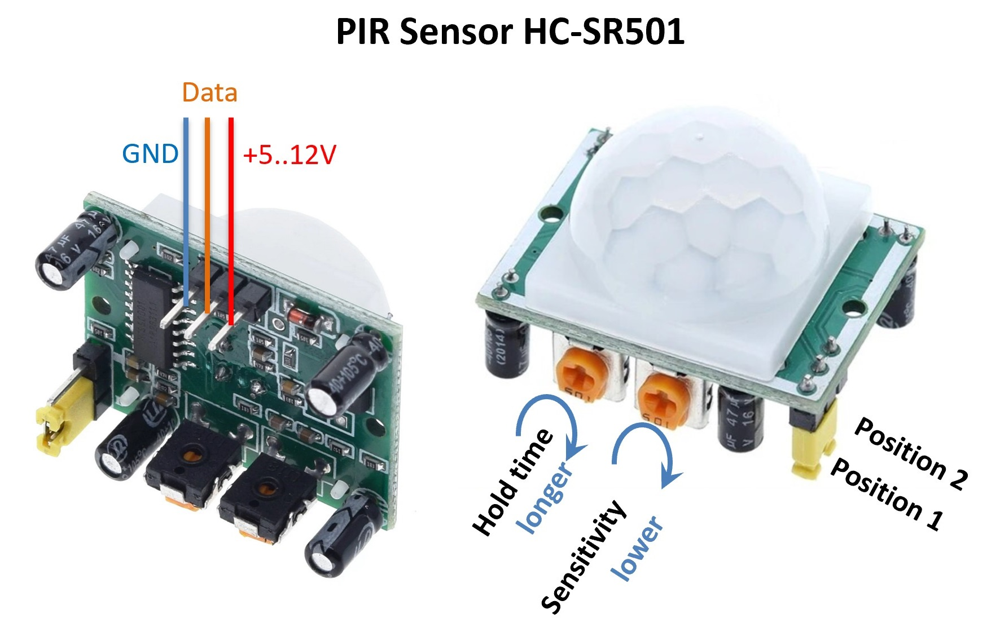

# PIR-Motion Sensor

인체감지 모션센서(적외선 변화 감지) 사용하기



- 동작전압 : 5~20V
- 출력전압 : 3.2V (HIGH), 0V (LOW)
- 센서각도 : 100도 이하
- 감지범위 : 7m 이하
- 동작온도 : -20 ~ 70도

### 동작 감도 세팅
- Hold Time : 시간조절 (0옴 : 2초 ~ 1메가옴 : 248초, 중간 120초 정도)
- Hold Time : 왼쪽 끝 2초, 중간 4분40초~50초, 1/4 지점 2분30초, 최대 10분 정도
- Sensitivity : 감도조절 (시계방향 : 민감도 낮음)
- Jumpper L : Non-Retriggering, 변화가 감지되면 일정시간 HIGH 유지
- Jumpper H : Retriggering, 변화가 감지되는 동안 HIGH 출력

### 아두이노에서 설정
- 입력핀 설정 : `pinMode(PIN번호, INPUT);`
- 데이터 읽기 :  `digitalRead()`로 읽는다. (Active High)
- 데이터 판단 : 센서 인식되면 HIGH, 평소에는 LOW 출력


### 샘플코드
```cpp title="sensor_sr501.ino" linenums="1" hl_lines="9"
#define SENSOR_PIN 7

void setup() {
    pinMode(SENSOR_PIN, INPUT);
    Serial.begin(115200);
}

void loop() {
    int chk = digitalRead(SENSOR_PIN);
    if(chk == HIGH) {
        Serial.println("DETECT");
    } else {
        Serial.println("NOT DETECT");
    }
    delay(200);
}
```
