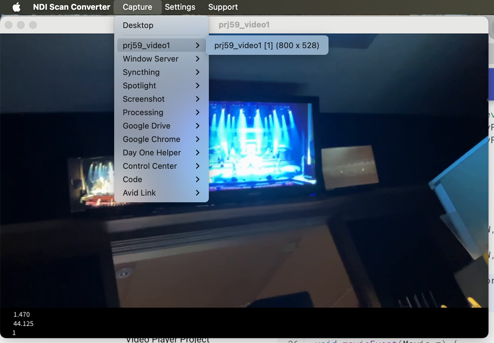
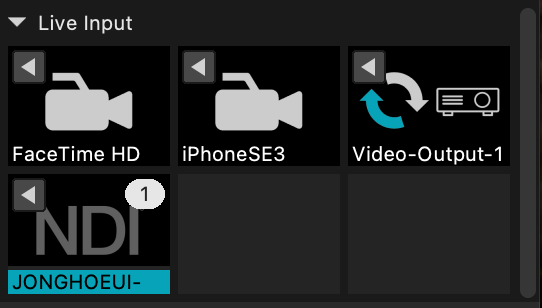

# Video Mapper Routing

1. 프로세싱으로 동영상 출력 상태가 됨
1. NDI Tools의 Scan Converter 실행
1. Scan Converter의 Capture 메뉴에서 프로세싱 실행 윈도우 선택
    

1. Mad Mapper에서 `Live Input` 항목의 NDI를 선택하면 동영상이 나타난다.
    
    * MadMapper에서 일반적인 영상 소스 사용하듯 NDI 영상을 사용할 수 있다.
1. Mad Mapper에서 맵핑 실행

