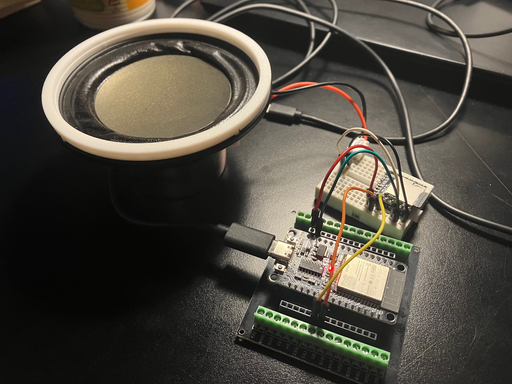

# 01. Basic Code

ESP32 & DFPlayer 초기화 및 동작확인 코드

* 전원이 켜지고 초기화되면 첫번째 곡(0001.mp3)이 1번 PLAY 된다.
* DFPlayer Class를 생성하고 초기화 하는 코드
* ESP32와 연결(RX,TX) 배선 주의
* DFPlayer 통신속도는 9600bps로 고정



```cpp title="prj_mp3player.ino" linenums="1" hl_lines="7"
/*
 *  ESP32 & MP3 Player
 */
#include "Arduino.h"
#include "DFRobotDFPlayerMini.h"

#define RX_PIN 16
#define TX_PIN 17

DFRobotDFPlayerMini dfPlayer;

volatile int chk_old = 0;

void setup() {
    Serial.begin(115200);
    Serial2.begin(9600, SERIAL_8N1, RX_PIN, TX_PIN);

    Serial.println("\n\nMP3 Program Start");
    if (!dfPlayer.begin(Serial2), false) {
        Serial.println("Unable to begin, Recheck the connection or SD Card!");
        while(true);
    }
    Serial.println("\rDFPlayer Mini online.");
    dfPlayer.setTimeOut(500);
    
    // MP3 Player Control
    dfPlayer.volume(24);  // Volume : 0~30
    dfPlayer.play(1);
}

void loop() {
    int chk = dfPlayer.readState();
    if(chk_old != chk) {
        Serial.print("CHK_CODE: ");
        Serial.printf("%08X", chk);
        Serial.println();
        chk_old = chk;
    }
}
```