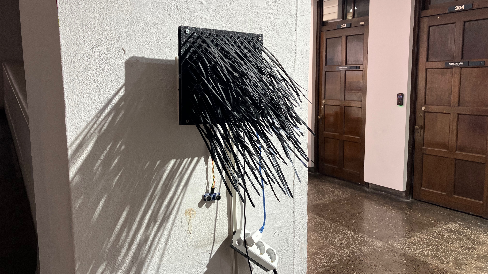
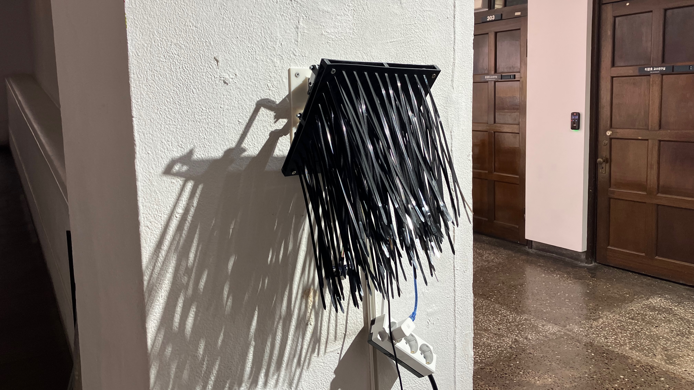
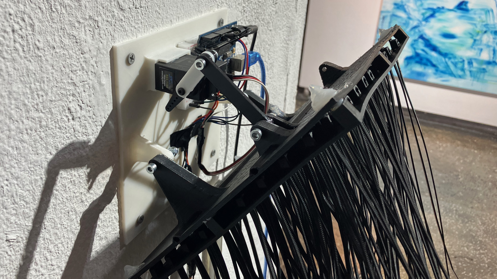
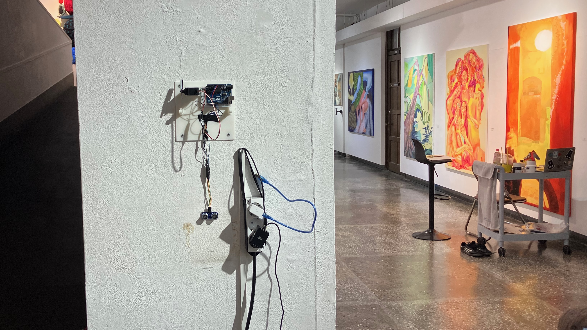

# 거리센서와 서보모터
* 거리 센서와 서보 모터를 사용한 프로젝트
* 사람이 다가 오면 서보 모터가 동작한다.
* 기본 위치로 대기하다가, 사람이 다가오면 지정 위치로 움직인다.
* 움직이는 동안 거리 센서 값을 읽지 않는다.
* 한 동작이 끝나고 복귀한 다음 지정 시간 동안 움직이지 않는다.
* HC-SR04 초음파 센서 사용한다.

```cpp title="prj_251_psj.ino" linenums="1" hl_lines="5"
/*
    이대 251 May 전시
    박수진 PROJECT
    2025.05.26
*/
#include <Servo.h>

#define TRIG_PIN 6
#define ECHO_PIN 7
#define SERV_PIN 9

const int tri = 60;
const int nor = 160;
const int time_tri = 1;
const int time_nor = 15;
const int time_hold = 2000;
const int time_ready = 2500;
const int tri_val = 80;       // 동작하는 위치, 지정값 보다 가까우면 동작한다

int chkAction = 0;
int led_status = HIGH;
long led_timer = 0;

Servo sv;

void setup() {
    Serial.begin(115200);
    pinMode(13, OUTPUT);
    pinMode(TRIG_PIN, OUTPUT);
    pinMode(ECHO_PIN, INPUT);
    sv.attach(SERV_PIN);
    servo2Nor();
    delay(time_ready);
}

void loop() {
    int val = readDist();
    Serial.println(val);
    if(val < tri_val && chkAction == 0) {
        Serial.println("TRIGGER");
        chkAction = 1;
        servo2Tri();
        delay(time_hold);
        Serial.println("Return");
        servo2Nor();
        delay(time_ready);
        chkAction = 0;
    }
    // LOOP - Ready Time LED BLINK
    if(millis() - led_timer > 500) {
        led_timer = millis();
        led_toggle();
    }
}
int readDist() {
    digitalWrite(TRIG_PIN, HIGH);
    delayMicroseconds(10);
    digitalWrite(TRIG_PIN, LOW);
    long dist = pulseIn(ECHO_PIN, HIGH) / 58;
    int getDist = 0;
    getDist = dist;
    delay(100);
    return getDist;   
}

void led_toggle() {
    if(led_status == HIGH) {
        led_status = LOW;
    } else {
        led_status = HIGH;
    }
    digitalWrite(13, led_status);
}

void servo2Tri() {
  for(int i=nor; i >= tri; i--) {
    sv.write(i);
    delay(time_tri);
  }
}

void servo2Nor() {
  for(int i=tri; i <= nor; i++) {
    sv.write(i);
    delay(time_nor);
  }
}
```




