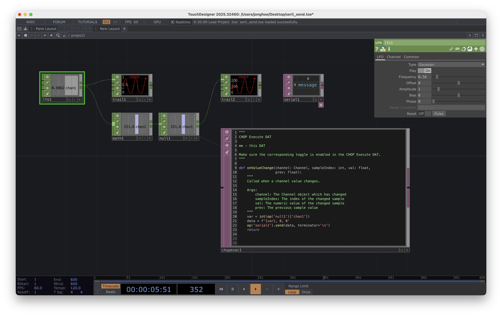

# 05. Arduino Serial Read
아두이노에서 시리얼 포트 읽기

- 아두이노 RGB LED 회로 구성
- 아두이노에서 RGB 켜지는 것 확인
- 아두이노에서 RGB 변수 값 교체하여 색깔 바꾸기
- 아두이노 시리얼 포트로 값을 받아 색깔 바꾸기 (정수형)
- 프로세싱에서 시리얼 포트로 값 내보내기 (마우스 위치를 보냄)
- 이두이노 시리얼 포트로 값을 받는데 소수점 형태의 수로 읽기
- 프로세싱에서 실수 형태로 값 보내기
- 샤땡에서 오디오 인터랙션으로 보내기


```cpp title="ew_0501.ino" linenums="1" hl_lines="1"
//
// RGB LED 색깔별로 깜빡이는 것 확인
//

#define PIN_R 9
#define PIN_G 10
#define PIN_B 11

void setup() {
    pinMode(PIN_R, OUTPUT);
    pinMode(PIN_G, OUTPUT);
    pinMode(PIN_B, OUTPUT);
}

void loop() {
    digitalWrite(PIN_R, HIGH);
    digitalWrite(PIN_G, LOW);
    digitalWrite(PIN_B, LOW);
    delay(300);
    digitalWrite(PIN_R, LOW);
    digitalWrite(PIN_G, HIGH);
    digitalWrite(PIN_B, LOW);
    delay(300);
    digitalWrite(PIN_R, LOW);
    digitalWrite(PIN_G, LOW);
    digitalWrite(PIN_B, HIGH);
    delay(300);
}
```

```cpp title="ew_0502.ino" linenums="1" hl_lines="19"
//
// RGB LED, 변수값 설정하여 색깔 바꾸기
//

#define PIN_R 9
#define PIN_G 10
#define PIN_B 11

void setup() {
    pinMode(PIN_R, OUTPUT);
    pinMode(PIN_G, OUTPUT);
    pinMode(PIN_B, OUTPUT);
}

void loop() {
    int val_r = 200;
    int val_g = 100;
    int val_b = 50;
    analogWrite(PIN_R, val_r);
    analogWrite(PIN_G, val_g);
    analogWrite(PIN_B, val_b);
}
```

```cpp title="ew_0503.ino" linenums="1" hl_lines="17"
//
// RGB LED, 변수값 설정하여 색깔 바꾸기
//

#define PIN_R 9
#define PIN_G 10
#define PIN_B 11

void setup() {
    pinMode(PIN_R, OUTPUT);
    pinMode(PIN_G, OUTPUT);
    pinMode(PIN_B, OUTPUT);
    Serial.begin(115200);
}

void loop() {
    while(Serial.available() > 0) {
        int val_r = Serial.parseInt();
        int val_g = Serial.parseInt();
        int val_b = Serial.parseInt();
        if(Serial.read() == '\n') {
            analogWrite(PIN_R, val_r);
            analogWrite(PIN_G, val_g);
            analogWrite(PIN_B, val_b);
        }
    }    
}
```

```java title="ew_0504.pde" linenums="1" hl_lines="16"
import processing.serial.*;

Serial port;

void setup() {
    size(255, 255);
    port = new Serial(this, "/dev/cu.usbmodem1101", 115200);
}

void draw() {
    background(255);
    int val1 = (int) map(mouseX, 0, width, 0, 255);
    int val2 = (int) map(mouseY, 0, height, 0, 255);
    int val3 = abs(val1 - val2);

    port.write(val1 + ", " + val2 + ", " + val3 + '\n');

    line(0, mouseY, width, mouseY);
    line(mouseX, 0, mouseX, height);
}
```

```cpp title="ew_0505.ino" linenums="1" hl_lines="18-22"
//
// RGB LED, 변수값 설정하여 색깔 바꾸기
//

#define PIN_R 9
#define PIN_G 10
#define PIN_B 11

void setup() {
    pinMode(PIN_R, OUTPUT);
    pinMode(PIN_G, OUTPUT);
    pinMode(PIN_B, OUTPUT);
    Serial.begin(115200);
}

void loop() {
    while(Serial.available() > 0) {
        float val_r = Serial.parseFloat();
        float val_g = Serial.parseFloat();
        float val_b = Serial.parseFloat();
        if(Serial.read() == '\n') {
            analogWrite(PIN_R, val_r * 255);
            analogWrite(PIN_G, val_g * 255);
            analogWrite(PIN_B, val_b * 255);
        }
    }    
}
```

```java title="ew_0506.pde" linenums="1" hl_lines="16"
import processing.serial.*;

Serial port;

void setup() {
    size(800, 500);
    port = new Serial(this, "/dev/cu.usbmodem1101", 115200);
}

void draw() {
    background(255);
    float val1 = map(mouseX, 0, width, 0.0, 1.0);
    float val2 = map(mouseY, 0, height, 0.0, 1.0);
    float val3 = abs(val1 - val2);

    port.write(val1 + ", " + val2 + ", " + val3 + '\n');

    line(0, mouseY, width, mouseY);
    line(mouseX, 0, mouseX, height);
}
```


```cpp title="ew_0507.ino" linenums="1" hl_lines="18-22"
#include <Servo.h>          // 서보모터 라이브러리 포함

#define PIN_SV 9            // 서보 제어 핀

Servo sv;

void setup() {
  sv.attach(PIN_SV);
}

void loop() {
    sv.write(0);
    delay(1000);
    sv.write(180);
    delay(1000);
}
```

```cpp title="ew_0508.ino" linenums="1" hl_lines="18-22"
#include <Servo.h>

#define PIN_SV 9

Servo sv;

void setup() {
    Serial.begin(115200);
    sv.attach(PIN_SV);
}

void loop() {
    while(Serial.available() > 0) {
        int val_sv1 = Serial.parseInt();
        int val_sv2 = Serial.parseInt();    // 시리얼로 입력되는 숫자 갯수가 3개 들어오니 일단 읽기는 한다
        int val_sv3 = Serial.parseInt();    // 시리얼로 입력되는 숫자 갯수가 3개 들어오니 일단 읽기는 한다
        
        val_sv1 = map(val_sv1, 0, 255, 0, 180);
        val_sv1 = constrain(val_sv1, 0, 180);
        
        if(Serial.read() == '\n') {
            sv.write(val_sv1);
        }
    }    
}
```

# 터치 디자이너에서 시리얼로 숫자 3개를 보내보자



- LFO : 신호 발생
- Math : 신호 출력 범위 조절
- Null : 출력 정리
- Chop to Exec : 채널의 변화에서 뭔가(시리얼)를 실행한다
- Seial : 출력 포트 지정