# 06. Arduino Serial Read + TD Write
- 아두이노에서 시리얼 읽고, TD에서 시리얼 쓰기

## Serial 포트로 RGB LED 제어하기

- 시리얼 포트로 정수값 3개가 입력된다.
- 각 숫자를 RGB 색깔에 대응해서 LED 색깔을 조절한다.

```cpp title="ew_0601.ino" linenums="1" hl_lines="17"
//
// RGB LED, 변수값 설정하여 색깔 바꾸기
//

#define PIN_R 9
#define PIN_G 10
#define PIN_B 11

void setup() {
    pinMode(PIN_R, OUTPUT);
    pinMode(PIN_G, OUTPUT);
    pinMode(PIN_B, OUTPUT);
    Serial.begin(115200);
}

void loop() {
    while(Serial.available() > 0) {
        int val_r = Serial.parseInt();
        int val_g = Serial.parseInt();
        int val_b = Serial.parseInt();
        if(Serial.read() == '\n') {
            analogWrite(PIN_R, val_r);
            analogWrite(PIN_G, val_g);
            analogWrite(PIN_B, val_b);
        }
    }    
}
```

## 터치 디자이너에서 시리얼로 숫자 3개를 보내보자


### 반복적인 신호 발생하기

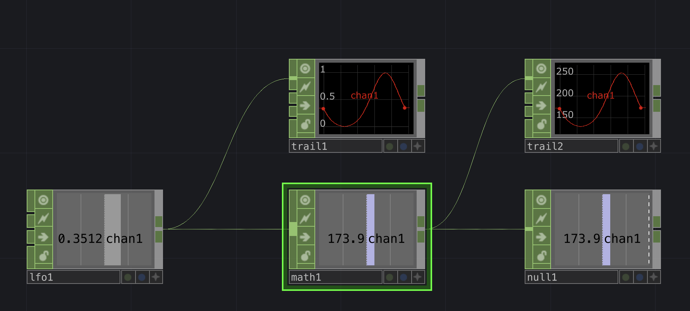

- 반복적인 신호를 만들어 낸다.
- CHOP_LFO : 신호 발생
- CHOP_Math : 신호 출력 범위 조절
- CHOP_Null : 출력 정리
- CHOP_Trail : 신호를 그래프로 나타내기 (단순 보기용으로 사용)

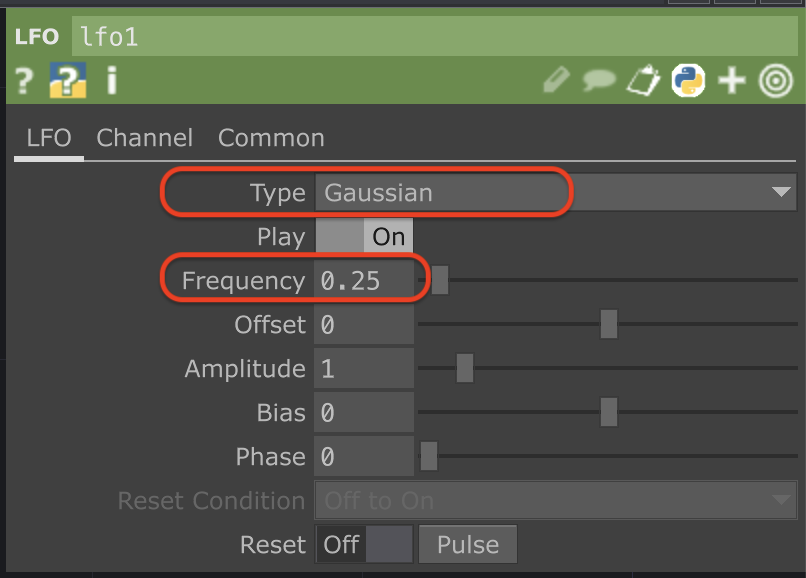{width="450px"}
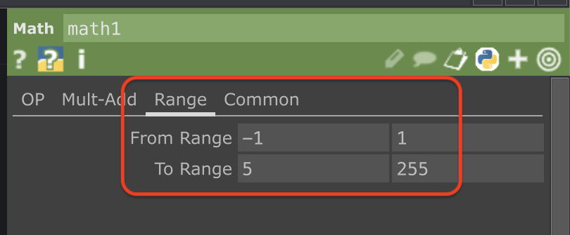{width="450px"}

### 시리얼포트 출력 파트

- DAT_Serial : Serial 포트를 읽거나 쓰기 위해 포트를 선택하고 제어함
- 다른 Op들과 연결 없이 단독으로 추가한다.
- 설정에서 아두이노가 있는 포트 선택하고, 속도 맞추기
- 아두이노의 Serial 모니터는 닫아야 에러가 생기지 않는다.
- 설정에서 Active On/Off 로 연결해제 / 재연결 할 수 있다.

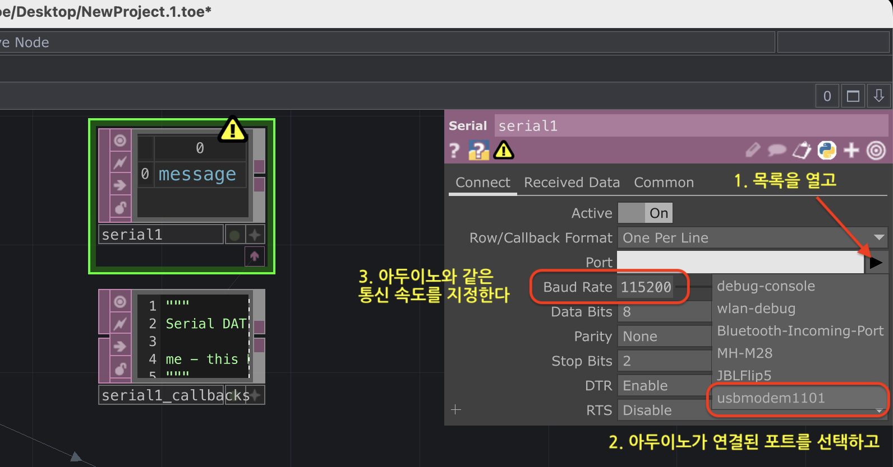
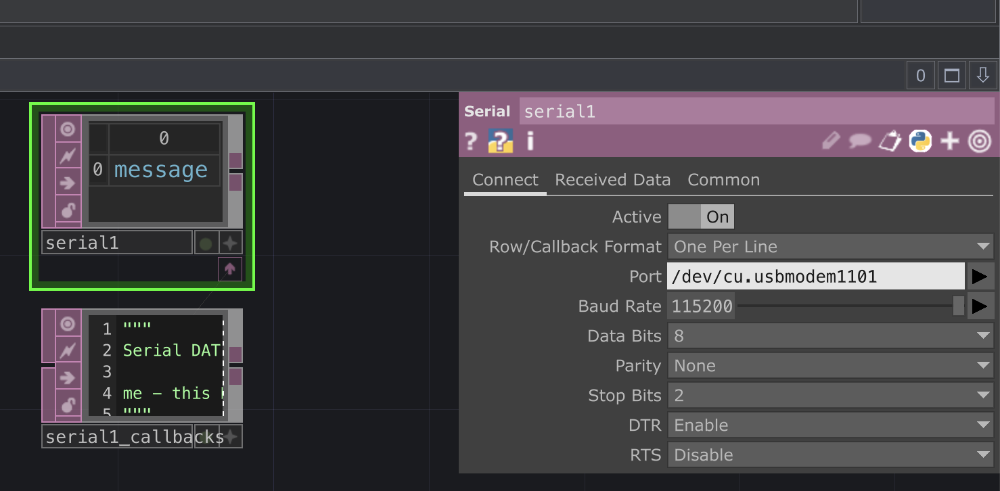

- DAT_Chop to Exec : CHOP 내용에서 뭔가를 실행할 때 사용함
- 빈 바탕에 추가 후 CHOP 항목에 입력참조값을 써서 연결한다. (연결 방법은 여러가지다)

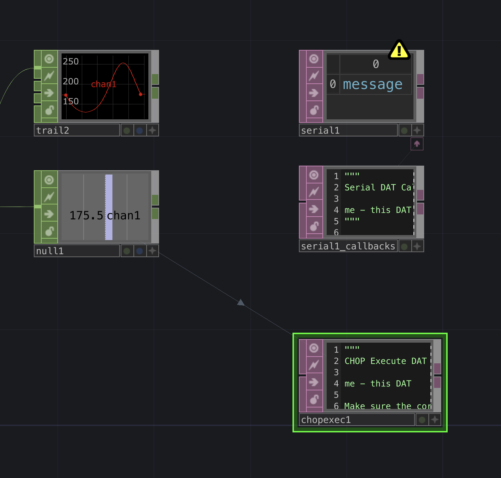

- Op 화면을 크게하고, 오른쪽 아래에 있는 + 기호를 눌러 내용을 편집한다.
- 여러 기능들을 사용할 수 있지만 지금은 화면에 나오는 내용으로 충분하다.

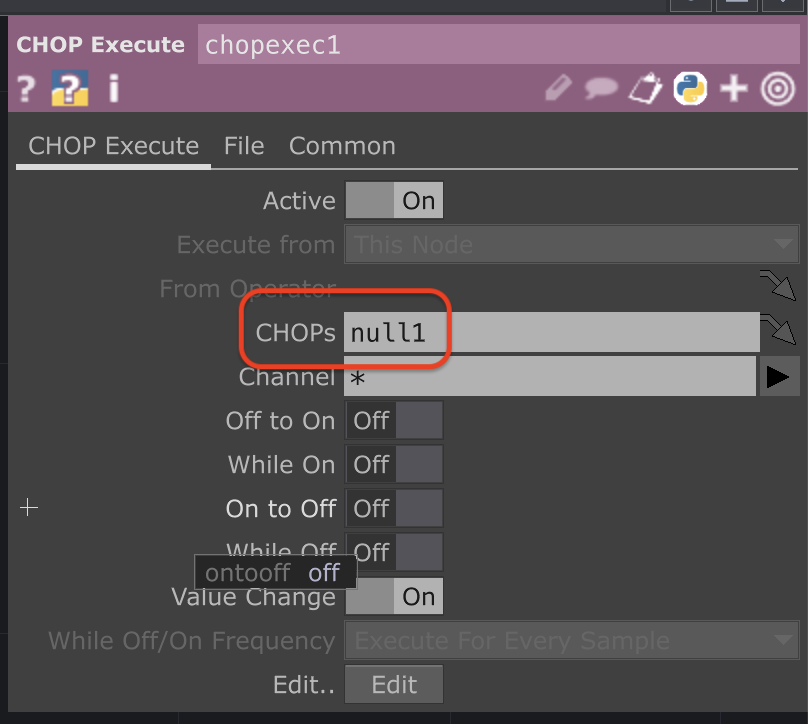{width="450px"}
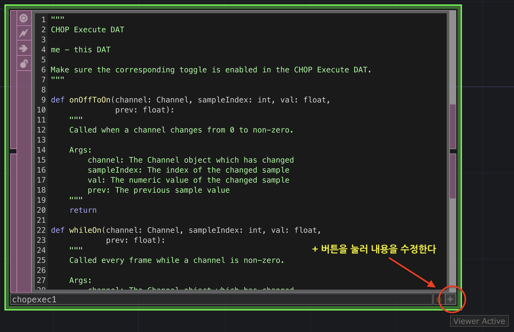{width="550px"}
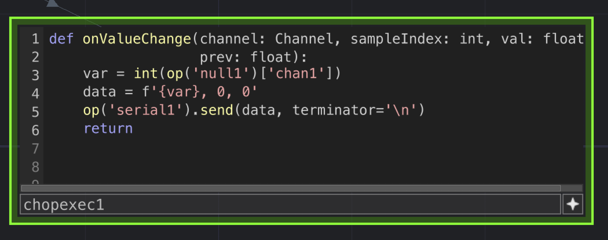{width="500px"}

```python title="ew_0602.py" linenums="1"
def onValueChange(channel: Channel, sampleIndex: int, val: float, prev: float):
    var = int(op('null1')['chan1'])
    data = f'{var}, 0, 0'
    op('serial1').send(data, terminator='\n')
    return
```

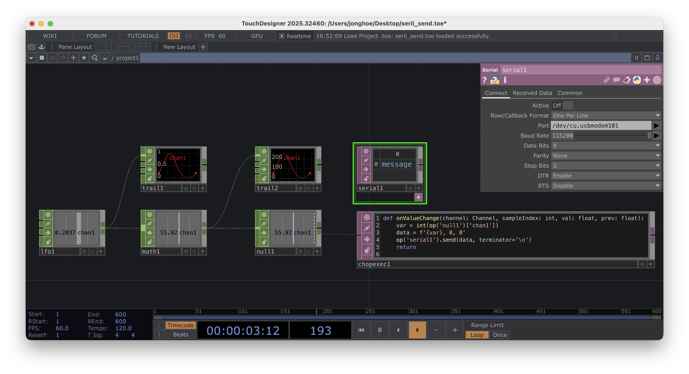

### 데이터 3개 출력하기

- CHOP_LFO, CHOP_Trail, CHOP_MATH, CHOP_NULL 2쌍 추가
- CHOP_LFO 성격을 다른 종류(Triangle, Ramp 등)로 설정해 데이터를 다양하게 구성한다.
- Trail에 표시되는 데이터의 범위에 맞게 Math 에서 Range 수정

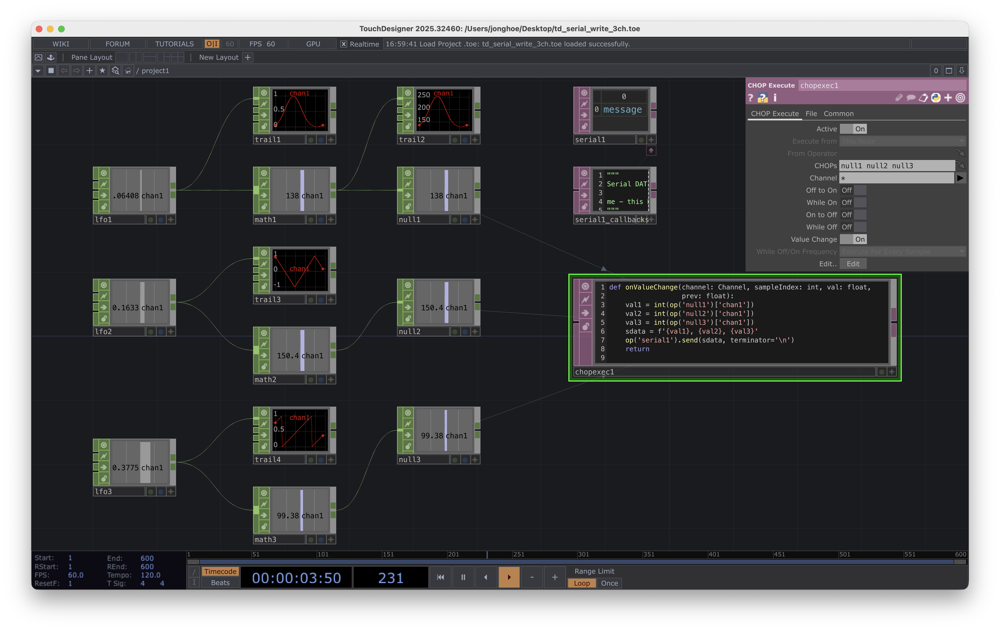

- DAT_ChopExcute : 참조할 변화 값이 3개 이므로 CHOPs 값을 수정한다.

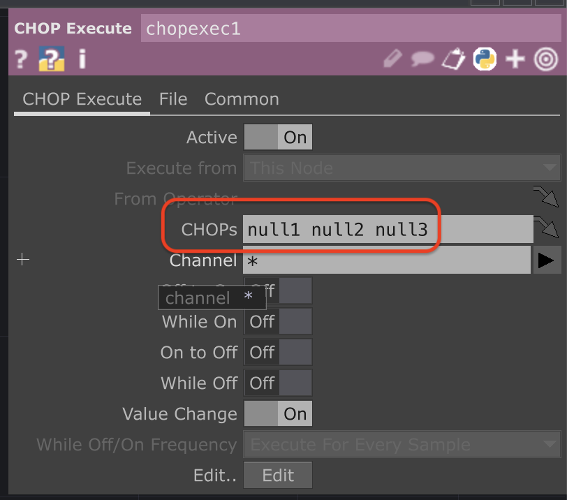{width="450px"}

- 코드 부분도 추가된 내용을 반영한다.

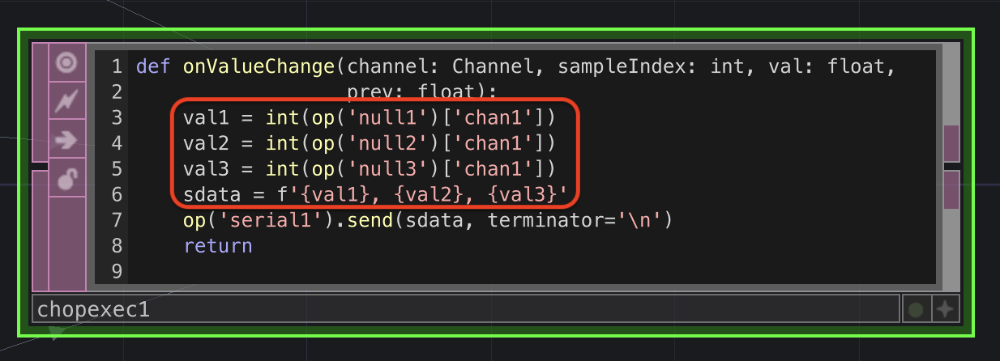

## 서보 모터 사용하기

- 서보 모터 사용을 위한 기본 세팅

```cpp title="ew_0602.ino" linenums="1" hl_lines="18-22"
#include <Servo.h>          // 서보모터 라이브러리 포함

#define PIN_SV 9            // 서보 제어 핀

Servo sv;

void setup() {
  sv.attach(PIN_SV);
}

void loop() {
    sv.write(0);
    delay(1000);
    sv.write(180);
    delay(1000);
}
```

- 시리얼 포트로 읽어서 서보에 반영하기

```cpp title="ew_0603.ino" linenums="1"
#include <Servo.h>

#define PIN_SV 9

Servo sv;

void setup() {
    Serial.begin(115200);
    sv.attach(PIN_SV);
}

void loop() {
    while(Serial.available() > 0) {
        int val_sv1 = Serial.parseInt();
        int val_sv2 = Serial.parseInt();    // 입력 데이터가 2개라
        int val_sv3 = Serial.parseInt();    // 읽기는 하지만 사용하진 않음
        
        if(Serial.read() == '\n') {
            sv.write(val_sv1);
        }
    }    
}
```

- 시리얼 포트로 읽어서 서보 3개에 반영하기

```cpp title="ew_0603.ino" linenums="1"
#include <Servo.h>

#define PIN_SV1 9
#define PIN_SV2 10
#define PIN_SV3 11

Servo sv1, sv2, sv3;

void setup() {
    Serial.begin(115200);
    sv1.attach(PIN_SV1);
    sv2.attach(PIN_SV2);
    sv3.attach(PIN_SV3);
}

void loop() {
    while(Serial.available() > 0) {
        int val_sv1 = Serial.parseInt();
        int val_sv2 = Serial.parseInt(); 
        int val_sv3 = Serial.parseInt(); 
        
        if(Serial.read() == '\n') {
            sv1.write(val_sv1);
            sv2.write(val_sv2);
            sv3.write(val_sv3);
        }
    }    
}
```
