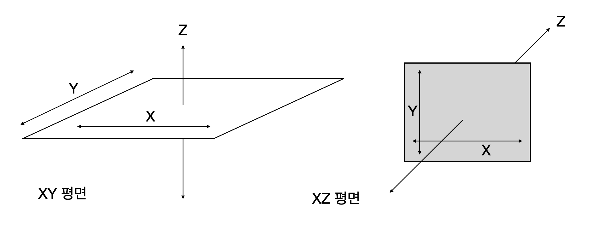
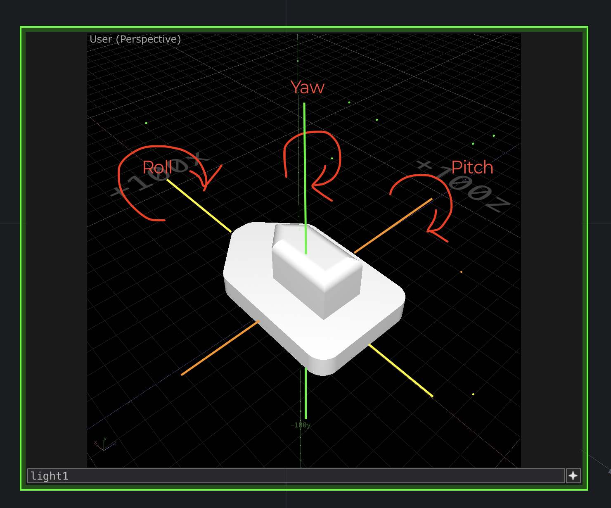

# 08-1. GyroAccel 센서

- BMI160 센서로 TD에 있는 3d 모델을 움직이게 한다.

## 1. BMI160센서와 TD의 XYZ 축 차이
- BMI160 센서는 XY면이 바닥이고 Z축이 수직 방향이다.
- TD는 XZ면이 바닥이고 Y축이 수직이다.
- 여기서 '바닥'은 중력이 작용하는 바닥(땅)을 표현하는 것

- XY 바닥은 종이 같은 느낌, XY 평면에 종이가 있고, Z 축은 종이가 쌓이듯 그림이 이동하는 것
- XZ 바닥은 TV 모니터 느낌, XY축에 TV 모니터처럼 그림면이 위치하고, Z 축으로 전진 후진 한다고 볼 수 있다
- XY 바닥 모델을 XZ 바닥 모델에 맞춰 사용하려면 축 변환이 필요하다.
    - XY-X = XZ-X
    - XY-Y = XZ-Z
    - XY-Z = XZ-Y


## 2. 아두이노 3축 센서 출력

### 2.1 BMI160 센서
- XY면을 바닥으로 한다.
- 중력 가속도 센서
    - XYZ 축 방향의 중력가속도를 출력한다.
    - 센서를 수평한 바닥에 놓았을 때 X = 0, Y = 0, Z = 9.8 이 출력됨
- 자이로 센서 : XYZ 축의 변화를 출력한다.
    - 움직임을 멈추면 0, 움직임이 있을 때 값이 있다.
    - 자료가 누적될 수록 오차가 생긴다 (Drift 현상)
- 중력가속도와 자이로센서를 혼합하여 사용한다. -> IMU (Intertial Measurement Unit 사용)
- 지자기센서와 함께 사용하거나, 자자기센서가 포함된 9축 센서 사용하면 더 정확한 값을 구할 수 있다.

### 2.2 아두이노와 BMI160 센서 연결
{width="600px"}

## 3. 아두이노 코드

```cpp title="ew_0801.ino" linenums="1" hl_lines="21-34"
#include <DFRobot_BMI160.h>
#include <Wire.h>

DFRobot_BMI160 bmi160;
const int8_t i2c_addr = 0x68;

const float ACCEL_SCALE = 1.0f / 16384.0f;
const float GYRO_SCALE = 1.0f / 16.4f;
const float D2R = 0.01745329f;            // 180도를 파이값으로 나눈 것

float roll = 0.0f, pitch = 0.0f, yaw = 0.0f;
float base_grx = 0, base_gry = 0, base_grz = 0;
unsigned long lastTime;

void setup() {
  Serial.begin(115200);
  if ((bmi160.softReset() != BMI160_OK) || (bmi160.I2cInit(i2c_addr) != BMI160_OK)) {
    Serial.println("init false");
    while(1);
  }
  //====== Gyro Offet Calibrating ======
  int samples = 100;
  for(int i=0; i < samples; i++) {
    int16_t data[6] = {0};
    bmi160.getAccelGyroData(data);
    base_grx += data[0];
    base_gry += data[1];
    base_grz += data[2];
    delay(10);
  }
  base_grx /= samples;
  base_gry /= samples;
  base_grz /= samples;
  //====================================
  lastTime = micros();
}

void loop() {
  unsigned long currentTime = micros();
  float dt = (currentTime - lastTime) * 0.000001f;
  if(dt <= 0.0f || dt > 0.1f) {
    lastTime = currentTime;
    return;
  }
  lastTime = currentTime;

  int16_t data[6] = {0};
  if (bmi160.getAccelGyroData(data) == 0) {
    float grx = ((data[0] - base_grx) * GYRO_SCALE) * D2R;  // Radian, 비율
    float gry = ((data[1] - base_gry) * GYRO_SCALE) * D2R;  // Radian, 비율
    float grz = ((data[2] - base_grz) * GYRO_SCALE) * D2R;  // Radian, 비율
    float ax = data[3] * ACCEL_SCALE;    // 중력가속도 값, 비율
    float ay = data[4] * ACCEL_SCALE;    // 중력가속도 값, 비율
    float az = data[5] * ACCEL_SCALE;    // 중력가속도 값, 비율

    // 중력가속도계 기준으로 Roll, Pitch 값 설정
    float accRoll = atan2(ay, az);
    float accPitch = atan2(-ax, sqrt(ay * ay + az * az));
    // 상보필터를 적용하여 데이터 보완 (Gyro 데이터 96% + 가속도 데이터 4% 적용)
    roll = 0.96f * (roll + grx * dt) + 0.04f * accRoll;
    pitch = 0.96f * (pitch + gry * dt) + 0.04f * accPitch;
    // YAW 값은 보완할 수 있는 자료가 없으므로 Gyro 데이터에 지연값 누적 처리
    // 지자계 센서 데이터로 보완 가능, BMI160에는 없음
    yaw += grz * dt;                            // Radian

    Serial.print(roll, 4); Serial.print(",");   // roll : radian
    Serial.print(pitch, 4); Serial.print(",");  // pitch : radian
    Serial.println(yaw, 4);                     // yaw : radian
  }
}
```

### 3.1 BMI160 센서 초기화
- 코드의 line 4, 5
    - BMI160 센서를 사용하기 위한 클라스 변수 bmi160 설정
    - BMI160 센서의 주소는 0x68로 설정 (센서의 SAO 핀이 GND와 연결되었을 때 주소)
- 코드의 line 17-20
    - BMI160 센서를 초기화 하고 I2C 통신이 가능한지 체크하는 과정
    - 연결 실패할 경우 다음 단계로 진행되지 않게 처리

### 3.2 BMI160 센서 읽기
- 코드의 line 47에서 데이터 읽기, data 배열에 저장됨
- 코드의 line 49-54, data 배열에서 Gyro 및 가속도 데이터로 변환하여 해당 변수로 저장

### 3.3 출력용 데이터 변환
- line 56-64, 센서값을 실제 사용하는 데이터로 변환
- Roll : 센서의 X 축(TD의 X축)을 기준으로 회전하는 비율(Radian)
- Pitch : 센서의 Y 축(TD의 Z축)을 기준으로 회전하는 비율(Radian)
- Yaw : 센서의 Z 축(TD의 Y축)을 기준으로 회전하는 비율(Radian)

### 3.4. Roll, Pitch, Yaw

{width="500px"}

- 3d 모델의 움직임을 표현하는 것으로 Roll, Pitch, Yaw가 사용됨
- 모형의 배치에 따라 각 기능은 XYZ축과 연결된다.
- 자동차는 Yaw 만 있다. (사고가 나면 Roll, Pitch가 동작하겠지)
- 비행기는 Roll, Pitch, Yaw가 모두 동작한다.
- 위 그림에서 배는 X축에 놓여있고(XZ 바닥), Y축이 수직이다.

### 3.5 시리얼로 출력하기
- line 66-68, 시리얼 데이터로 출력, 소숫점 4자리로 표현했다.
- roll, pitch, yaw 순서로 출력한다. (Radian 값으로 출력)

