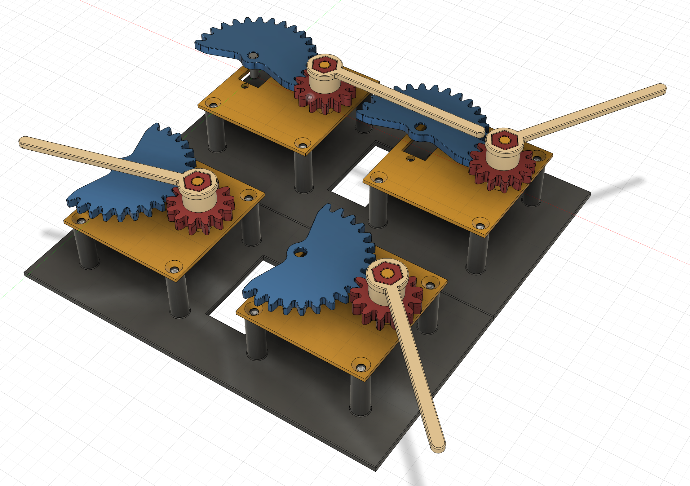

# Welcome MAL
Makers Art Lab

간단한 프로젝트를 구현하는 과정에서 프로세싱, 아두이노 코딩을 학습한다.

## Projects List

### 바늘 1개 시계

* 바늘이 하나 있는 시계, 마우스를 따라 움직인다.
* 물리적인 장치와 연동해서 화면의 움직임이 장치의 움직임으로 표현될 수 있게 한다.
* 프로세싱의 기능을 학습하기 위한 프로젝트
* 아두이노와 연동, 시리얼 통신, 클라스 사용, 벡터 사용 학습

https://jonghoe9.github.io/makers-art-lab/
