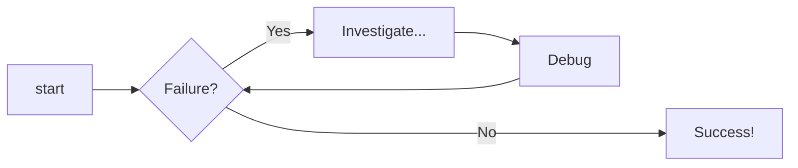
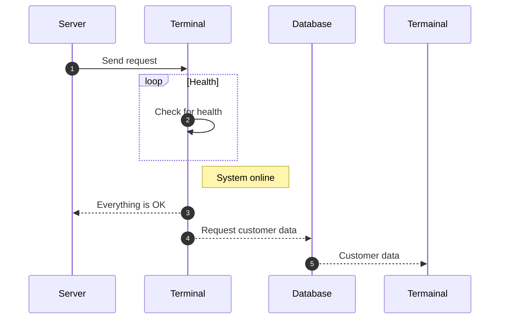

# 다이어그램 사용

squidfunk 사이트의 리퍼런스 페이지에 여러 사례가 나타나 있음

[다이어그램 설명 페이지 바로가기](https://squidfunk.github.io/mkdocs-material/reference/diagrams/)

## 플로우 차트

```mermaid
graph LR
    A[start] --> B{Failure?};
    B -->|Yes| C[Investigate...];
    C --> D[Debug];
    D --> B;
    B ---->|No| E[Success!];
```

## 순서도

```mermaid
sequenceDiagram
    autonumber
    Server->>Terminal: Send request
    loop Health
        Terminal->>Terminal: Check for health
    end
    Note right of Terminal: System online
    Terminal-->>Server: Everything is OK
    Terminal-->>Database: Request customer data
    Database-->>Termainal: Customer data
```